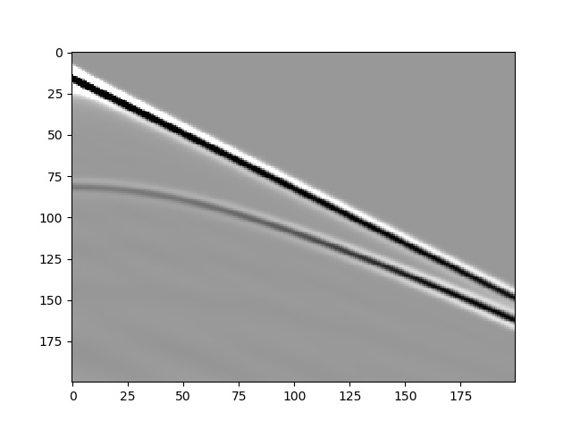

# Deepwave

[](https://doi.org/10.5281/zenodo.3829886)

Deepwave provides wave propagation modules for PyTorch, for applications such as seismic imaging/inversion. You can use it to perform forward modelling and backpropagation, so it can simulate wave propagation to generate synthetic data, invert for the scattering potential (RTM/LSRTM) or wavespeed (FWI), or you can use it to integrate wave propagation into a larger chain of operations.

## Features
- Supports regular and Born modelling of the 2D constant density acoustic / scalar wave equation
- Runs on CPUs and appropriate GPUs
- The gradient of all outputs (final wavefields and receiver data) can be calculated with respect to the wavespeed, scattering potential, initial wavefields, and source amplitudes
- Uses the [Pasalic and McGarry](https://doi.org/10.1190/1.3513453) PML for accurate absorbing boundaries
- The PML width for each edge can be set independently, allowing a free surface (no PML) on any side
- Finite difference accuracy can be set by the user
- A region of the model around the sources and receivers currently being propagated can be automatically extracted to avoid the unnecessary computation of propagation in distant parts of the model

## Quick Example

This example demonstrates forward modelling of three shots in a simple model using Deepwave.
```python
import torch
import deepwave
import matplotlib.pyplot as plt

device = torch.device('cpu')
nx = 100
ny = 200
grid_spacing = 4
n_shots = 3
n_sources_per_shot = 1
n_receivers_per_shot = ny
freq = 25
nt = 200
dt = 0.004
peak_time = 1.5 / freq

# Velocity model (top layer 1500 m/s, bottom 2000 m/s)
v = 1500 * torch.ones(nx, ny, device=device)
v[50:] = 2000

# Shot 1 source located at cell [0, 1], shot 2 at [0, 2], shot 3 at [0, 3]
source_locations = torch.zeros(n_shots, n_sources_per_shot, 2,
                               dtype=torch.long, device=device)
source_locations[:, 0, 1] = torch.arange(n_shots)

# Receivers located at [0, 1], [0, 2], ... for every shot
receiver_locations = torch.zeros(n_shots, n_receivers_per_shot, 2,
                                 dtype=torch.long, device=device)
receiver_locations[:, :, 1] = (
    torch.arange(n_receivers_per_shot).repeat(n_shots, 1)
)

source_amplitudes = (
    deepwave.wavelets.ricker(freq, nt, dt, peak_time)
    .repeat(n_shots, n_sources_per_shot, 1)
    .to(device)
)

out = deepwave.scalar(v, grid_spacing, dt,
                      source_amplitudes=source_amplitudes,
                      source_locations=source_locations,
                      receiver_locations=receiver_locations)

# Plot the first shot
receiver_amplitudes = out[-1].cpu()
vmin, vmax = torch.quantile(receiver_amplitudes[0],
                            torch.tensor([0.01, 0.99]))
plt.imshow(receiver_amplitudes[0].T, aspect='auto', cmap='gray',
           vmin=vmin, vmax=vmax)
plt.xlabel("Receiver")
plt.ylabel("Time sample")
```


## Get started

[The documentation](https://ausargeo.pages.dev/deepwave) contains examples and instructions on how to install and use Deepwave.

## Note about v0.0.10

The v0.0.10 release of Deepwave involved a complete rewrite of the code. This resulted in several improvements such as new features, but also removed 1D and 3D propagators to allow greater focus on the more popular 2D propagators. It also involved changes to the interface. The most important of these are that source and receiver coordinates are now provided as integers in units of cells rather than floats in the same units as `grid_spacing`, and that the time dimension is now the final rather than the first dimension. You may install the last version from before the rewrite using `pip install deepwave==0.0.9`.

For example, this code from before v0.0.10:
```python
# source_locations and receiver_locations in units of distance (e.g. meters)
# source_amplitudes of dimensions [time, shot, source]
prop = deepwave.scalar.Propagator({'vp': model}, grid_spacing)
receiver_amplitudes = prop(source_amplitudes, source_locations,
                           receiver_locations, dt)
```
should be replaced by:
```python
# source_locations and receiver_locations in units of grid cells
# source_amplitudes of dimensions [shot, source, time]
prop = deepwave.Scalar(model, grid_spacing)
receiver_amplitudes = prop(dt, source_amplitudes=source_amplitudes,
                           source_locations=source_locations,
                           receiver_locations=receiver_locations)[-1]
```
or
```python
receiver_amplitudes = deepwave.scalar(model, grid_spacing, dt,
                                      source_amplitudes=source_amplitudes,
                                      source_locations=source_locations,
                                      receiver_locations=receiver_locations)[-1]
```
