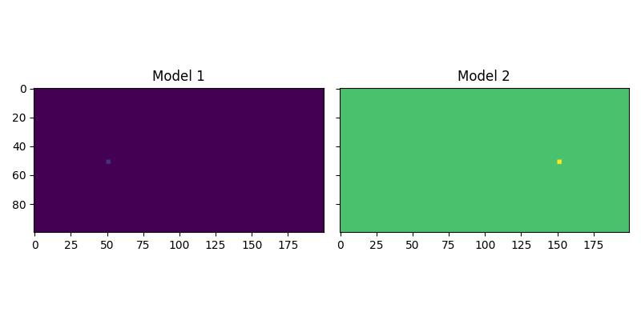
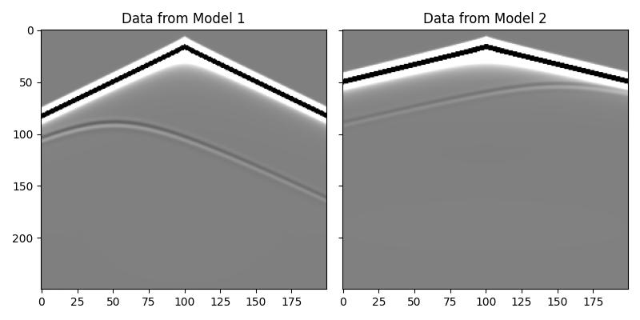
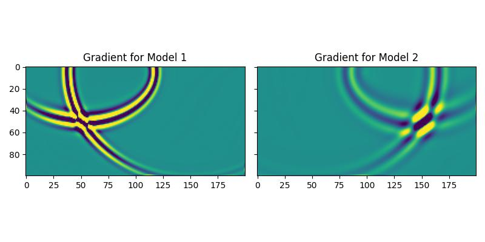
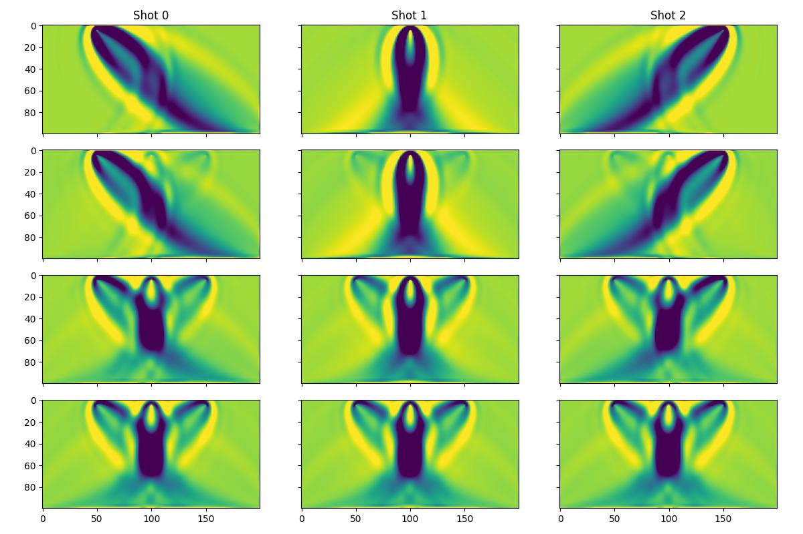

Using Batched Models
====================

Deepwave's propagators support batched models, which means you can provide a batch of property models (such as velocity) instead of a single one. This allows you to run multiple simulations with different physical properties simultaneously. This example demonstrates how to use this feature.

Forward and Backward Propagation with Batched Models
----------------------------------------------------

First, we will see how to propagate two shots through two different velocity models at the same time. We begin by creating a batch of two models. The first has a background velocity of 1500 m/s, and the second has a background velocity of 3000 m/s. We then add a small high-velocity block to each model, but in different locations.

.. code-block:: python

    ny = 100
    nx = 200
    dx = 4.0
    v_background1 = 1500.0
    v_background2 = 3000.0
    v = torch.ones(2, ny, nx, device=device)
    v[0] *= v_background1
    v[1] *= v_background2

    # Add a high-velocity anomaly to each model in a different location
    v[0, ny // 2 : ny // 2 + 3, nx // 4 : nx // 4 + 3] = 1800.0
    v[1, ny // 2 : ny // 2 + 3, 3 * nx // 4 : 3 * nx // 4 + 3] = 3600.0

The resulting velocity models are shown below:

We can now set up our sources and receivers. We will have two shots, and the first shot will be propagated through the first model, while the second shot will be propagated through the second model. In this example we will use the same source and receiver locations for both shots, but that is not required. We pass the batch of velocity models to ``deepwave.scalar``, and it handles the rest.

.. code-block:: python

    out = deepwave.scalar(
        v,
        dx,
        dt,
        source_amplitudes=source_amplitudes,
        source_locations=source_locations,
        receiver_locations=receiver_locations,
        max_vel=v.max().item(),
    )
    receiver_data = out[-1]

The output ``receiver_data`` will have a batch dimension corresponding to the shots and models. As you can see in the plot below, the data for the two shots are quite different, despite having the same source location, due to the different background velocities and anomaly locations.

This batching also works for backpropagation. When we compute the gradient, a separate gradient is calculated for each model in the batch. We can see this in action by backpropagating a simple loss function and plotting the gradients. The resulting gradients show the anomalies from their respective velocity models, confirming that they were calculated independently.

Inversion with a Model-Difference Penalty
------------------------------------------

As an example of the kind of ideas that this feature enables, we will now apply inversion to a survey, but each shot will have its own velocity model. We will then add a penalty term to the loss function to encourage all of these individual models to converge towards a similar result.

First, we create a single "true" model and use it to generate synthetic data for three shots.

Then, we create a batch of three initial models (one for each shot). During the inversion, we will update all three models simultaneously, only using the loss function of the corresponding shot.

The loss function for each shot will have two parts:

    1. A standard data-misfit term (Mean Squared Error).
    2. A penalty term that measures the variance between the three models.

The total loss is the sum of these two terms. We also introduce a ``penalty_weight`` that increases over epochs. This applies the consistency constraint more strongly as the inversion progresses, gently forcing the models to become more similar over time.

.. code-block:: python

    # Inversion loop
    for epoch in range(n_epochs):
        # The weight of the penalty term increases with epochs
        penalty_weight = 1e4 * (epoch / (n_epochs - 1)) ** 2
    
        optimiser.zero_grad()
    
        # Forward propagate all shots, each with its own model
        pred_data = deepwave.scalar(
            v_init,
            dx,
            dt,
            source_amplitudes=source_amplitudes_inv,
            source_locations=source_locations_inv,
            receiver_locations=receiver_locations_inv,
        )[-1]
    
        # Data misfit loss
        loss_mse = 1e9 * loss_fn(pred_data, true_data)
    
        # Model difference penalty
        # Penalise the variance between the models
        loss_penalty = torch.pow(v_init - v_init.mean(dim=0), 2).mean()
    
        # Total loss
        loss = loss_mse + penalty_weight * loss_penalty
        loss.backward()
        optimiser.step()

The figure below shows the inverted velocity models of the three shots as the inversion progresses, with lower rows corresponding to later epochs. We can see that each model initially only includes contributions from the corresponding shot (since the penalty term for variance across the models is initially zero). After several epochs, the penalty term gets stronger and all three models converge to a similar result.

This example shows how batched models can be used for more than just running independent simulations in parallel; they can be integrated into custom inversion workflows to enforce complex constraints across a batch of models.

`Full example code <https://github.com/ar4/deepwave/blob/master/docs/example_batched_models.py>`_
