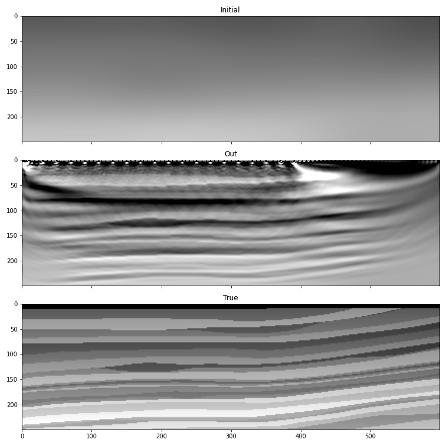

Reducing memory consumption with checkpointing
==============================================

Calculating gradients with respect to the velocity model requires access to the forward wavefield, sampled at at least the Nyquist frequency, during backpropagation. Deepwave achieves this by storing snapshots of the forward wavefield in memory. This works well for most cases, but if you have a large model and a small amount of memory, it might require more memory than you have available. For these situations, it is possible to reduce the memory requirement by doing extra computation using checkpoints.

PyTorch's `checkpoint <https://pytorch.org/docs/stable/checkpoint.html>`_ utility calls the specified function with the provided input arguments. It saves those input arguments. It also causes the called function to not save snapshots for backpropagation, reducing memory consumption. During backpropagation, the checkpointed functions will run again when needed, and this time will save snapshots. If we divide the forward propagation into five time segments and checkpoint each one, then we can get exactly the same result as if we had not used checkpoints, but only use about one fifth of the memory as we will only ever need to store snapshots for one fifth of the time steps at a time. It will, however, require more computation as now the forward propagation needs to be done twice (once for all segments at the beginning, as usual, and then again for each segment during backpropagation).

A complication is that Deepwave may need to use a smaller time step interval than the one that you specify, in order to obey the `CFL condition <https://en.wikipedia.org/wiki/Courant%E2%80%93Friedrichs%E2%80%93Lewy_condition>`_. When this occurs, Deepwave will upsample the source amplitudes (and then downsample the receiver amplitudes). This causes a slight problem when we use checkpointing, as upsampling a segment of the source amplitudes may not produce the same result as when all of the time samples of the source amplitudes are upsampled together, causing the output of propagation to be a bit different when checkpointing is used. To avoid this, we can upsample the source amplitudes ourselves before dividing them into segments and passing them to Deepwave. To do this, we will first find out what time step interval (`dt`) is needed to obey the CFL condition, and what factor of upsampling is needed to achieve this (`step_ratio`). We will then upsample the source amplitudes by this factor. As the output receiver amplitudes will now also have this same time step interval, we will also upsample the observed data so that we can compare the two in the cost function::

    dt, step_ratio = deepwave.common.cfl_condition(dx, dx, dt, max_vel)
    source_amplitudes = deepwave.common.upsample(source_amplitudes, step_ratio)
    observed_data = deepwave.common.upsample(observed_data, step_ratio)
    nt = source_amplitudes.shape[-1]

We will create a wrapper around the call to Deepwave's propagator so that we only need to pass the velocity model, the chunk of source amplitude samples in the current segment, and the wavefields at the start of the segment. Because we have upsampled the source amplitudes, we know that the actual maximum non-zero frequency in the data is several times lower than the Nyquist frequency, so we specify `model_gradient_sampling_interval` to only sample the integral for calculating the model gradient (and thus only store snapshots of the forward wavefield) every `step_ratio` time steps, avoiding unnecessary memory consumption::

    def wrap(v, chunk, wavefield_0, wavefield_m1, psiy_m1, psix_m1,
             zetay_m1, zetax_m1):
        return scalar(
                      v, dx, dt,
                      source_amplitudes=chunk,
                      source_locations=source_locations,
                      receiver_locations=receiver_locations,
                      pml_freq=freq,
                      wavefield_0=wavefield_0,
                      wavefield_m1=wavefield_m1,
                      psiy_m1=psiy_m1,
                      psix_m1=psix_m1,
                      zetay_m1=zetay_m1,
                      zetax_m1=zetax_m1,
                      max_vel=max_vel,
                      model_gradient_sampling_interval=step_ratio
                  )

The optimisation iteration loop looks a bit complicated, but it's actually just a few simple parts. In order to propagate one time segment, we need to provide the propagator with the initial wavefields (including the PML-related psi and zeta wavefields), which will be the wavefields from the end of the previous segment. These wavefields are zero at the start of the first segment, so we create and zero-initialise them at the beginning of each step. We also create a Tensor to hold the receiver amplitudes, into which we will copy the receiver amplitudes that are produced from each time segment. We loop over the time segments, using PyTorch's `chunk <https://pytorch.org/docs/stable/generated/torch.chunk.html>`_ utility to chop the source amplitudes into our desired number of segments. We then call the propagator on each segment. As a small optimisation, we do not checkpoint the final segment, as doing so would not save any memory. As in :doc:`the increasing frequency FWI example <example_increasing_freq_fwi>`, we use a function to constrain the velocity model to a desired range and lowpass filter the amplitudes, but to keep this example simple we will only use one cutoff frequency::

    for epoch in range(n_epochs):
        def closure():
            pml_width = 20
            wavefield_size = [n_shots, ny + 2 * pml_width, nx + 2 * pml_width]
            wavefield_0 = torch.zeros(*wavefield_size, device=device)
            wavefield_m1 = torch.zeros(*wavefield_size, device=device)
            psiy_m1 = torch.zeros(*wavefield_size, device=device)
            psix_m1 = torch.zeros(*wavefield_size, device=device)
            zetay_m1 = torch.zeros(*wavefield_size, device=device)
            zetax_m1 = torch.zeros(*wavefield_size, device=device)
            optimiser.zero_grad()
            receiver_amplitudes = torch.zeros(n_shots, n_receivers_per_shot, nt,
                                              device=device)
            v = model()
            k = 0
            for i, chunk in enumerate(torch.chunk(source_amplitudes, n_segments,
                                                  dim=-1)):
                if i == n_segments - 1:
                    (wavefield_0, wavefield_m1, psiy_m1, psix_m1,
                     zetay_m1, zetax_m1, receiver_amplitudes_chunk) = \
                        wrap(v, chunk, wavefield_0,
                             wavefield_m1,
                             psiy_m1, psix_m1,
                             zetay_m1, zetax_m1)
                else:
                    (wavefield_0, wavefield_m1, psiy_m1, psix_m1,
                     zetay_m1, zetax_m1, receiver_amplitudes_chunk) = \
                     torch.utils.checkpoint.checkpoint(wrap, v, chunk, wavefield_0,
                                                       wavefield_m1,
                                                       psiy_m1, psix_m1,
                                                       zetay_m1, zetax_m1)
                receiver_amplitudes[..., k:k+chunk.shape[-1]] = \
                    receiver_amplitudes_chunk
                k += chunk.shape[-1]
            receiver_amplitudes = filt(taper(receiver_amplitudes))
            loss = 1e6 * loss_fn(receiver_amplitudes, observed_data)
            loss.backward()
            return loss

        optimiser.step(closure)

The output is different to the previous example, but this is not because we used checkpointing (which should not affect the result), but rather because we only used the data up to 10 Hz.

Checkpointing should probably only be considered if you do not have enough memory to run even one shot at a time, as otherwise it is likely to be more efficient to divide your input into batches that you run one at a time and accumulate the gradient over them, as we did in :doc:`the RTM example <example_rtm>`.

`Full example code <https://github.com/ar4/deepwave/blob/master/docs/example_checkpointing.py>`_
