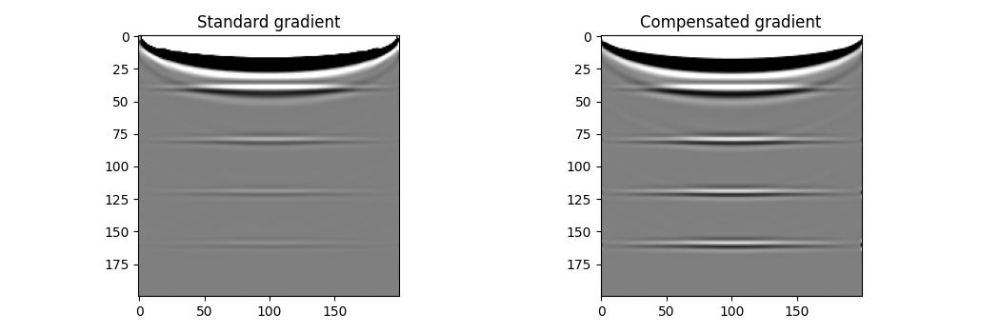

Custom imaging condition
========================

The operation that is applied to the forward and backward wavefields in order to calculate the gradient with respect to the model is often referred to as the "imaging condition" in seismic inversion. Deepwave uses the imaging condition that will calculate the gradients correctly, but sometimes you might wish to implement your own custom imaging condition. In this example I present two possible ways of achieving this. The first combines Deepwave's standard propagator interface with PyTorch's `backward hooks <https://pytorch.org/docs/stable/generated/torch.Tensor.register_hook.html>`_. The second is a lower level implementation that might provide better performance. In both cases we will implement the same imaging condition as Deepwave: the scaled sum over time and shots of the pointwise product of the backward wavefield and the second time derivative of the forward wavefield. The full code for both methods is linked at the bottom of the page.

Method 1: public interface and hooks
------------------------------------

The advantages of Method 1 are that it uses Deepwave's public interface, benefiting from its documentation and the lower risk (compared to Method 2's approach) that future versions of Deepwave will cause it to break. It is also simpler than Method 2. The cost of this is that it can be quite a bit slower than Method 2, due to the overhead of doing a lot of work in Python every timestep.

The idea is that we will use a loop over timesteps in Python. We will save the second time derivative of the forward wavefield, and we will create a backward hook for the wavefield. This hook will cause the hook function that we define to run when we reach the timestep where it was defined during backpropagation. We can thus use this hook function to implement our custom imaging condition, accumulating the product of the wavefield at the current step of backpropagation and the second time derivative that we stored for this timestep during forward propagation::

    # Create a hook to apply the imaging condition during backpropagation
    def hook_closure():
        bi = i
    
        def hook(x):
            if x is not None:
                # Apply the imaging condition
                out[0] += 2 / v.detach() * step_ratio * (
                    source_wavefields[bi] *
                    x.detach()[:, pml_width:-pml_width,
                               pml_width:-pml_width]).sum(dim=0)
    
        return hook
    
    wavefield_0.register_hook(hook_closure())

There are only two small complications. The first is that, since we call Deepwave's propagator with time chunks of the source amplitudes, we first need to upsample the source amplitudes. The same issue was discussed in the :doc:`checkpointing example <example_checkpointing>`. The second is that to calculate the second time derivative of the wavefield in the last time step of each time chunk we need three timesteps of the forward wavefield, but Deepwave only stores two. We overcome this problem by saving the input wavefield to the time chunk's last timestep, and its two output wavefields.

Method 2: internal interface
----------------------------

Method 2 avoids the overhead of doing a lot of work in Python each timestep by operating at a lower level. Rather than calling Deepwave's public interface, which performs a lot of setup each time it is called, Method 2 performs that setup once itself and then directly calls Deepwave's C or CUDA code within its loop over timesteps. It is based on Deepwave's own propagator code, for example the `scalar propagator <https://github.com/ar4/deepwave/blob/master/src/deepwave/scalar.py>`_. Although the code is quite long and might look complicated, the majority of it should not need to be altered if you wish to implement a different imaging condition. In the implementation that I used for this example, the initial setup and forward propagation are the same as the regular scalar propagator. I only needed to change backpropagation so that instead of doing the entire loop over timesteps within the C/CUDA code, I use a loop over time chunks in Python. This enables me to access the backward wavefield at the desired timesteps for the imaging condition. It was particularly easy in this case because Deepwave's C/CUDA forward propagator already stores snapshots of the second time derivative of the forward wavefield, so I didn't need to make any changes to that. If you wish to use something other than the second time derivative of the forward wavefield then you might need to use a Python loop over timesteps in the  forward propagator as well, in order to store snapshots of your desired wavefield.

Results
-------

All three methods produce almost identical results, as expected. The runtimes are not equal, however. On a CPU, the runtimes when I tested it were::

    Method 1: 5.5 s
    Method 2: 0.8 s
    Regular Deepwave: 0.7 s

The additional complexity of Method 2 might thus be worth it if you plan to run many iterations. As always, the full codes for both methods are available at the link below.

`Full example code <https://github.com/ar4/deepwave/blob/master/docs/example_custom_imaging_condition.py>`_
