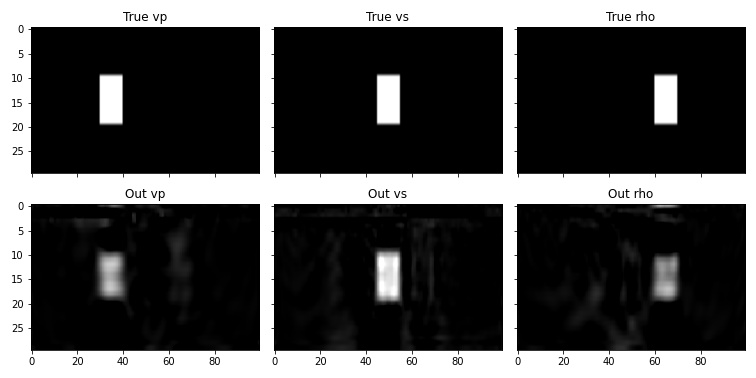
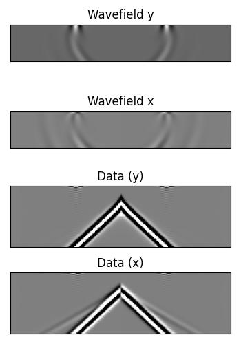
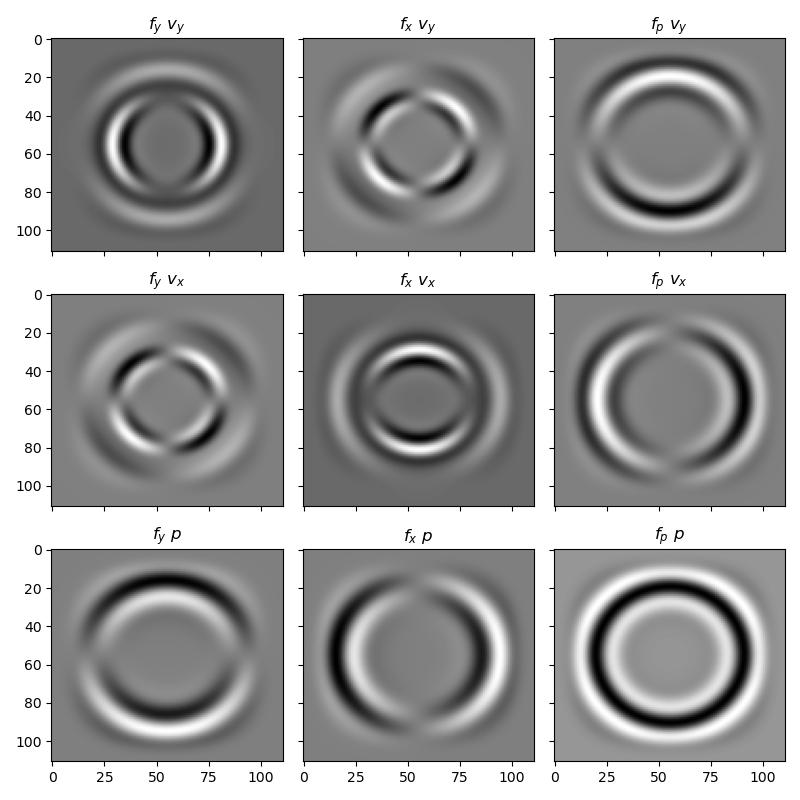

Elastic propagation and FWI
===========================

The regular scalar propagator has one model parameter (wavespeed). The scalar Born propagator has two (wavespeed and scattering potential). The elastic propagator has three. This makes it interesting to study as an inverse problem, because, in addition to the difficulties that already exist with scalar wave propagation inversion, there are problems caused by crosstalk between the model parameters. The ease of experimenting with different model parameterisations and loss functions makes Deepwave well suited to trying out new ideas to solve these problems. In this example we will just perform a simple forward propagation and inversion, though, to show you the basics.

One popular way to parameterise elastic propagation is with :math:`v_p`, :math:`v_s`, and :math:`\rho` (the p and s wavespeeds and the density). Another uses :math:`\lambda`, :math:`\mu`, and buoyancy (the two Lamé parameters and the reciprocal of density). Deepwave internally uses the latter, and provides functions to convert between the two parameterisations. To demonstrate that you can parameterise the model any way that you like and use PyTorch's end-to-end forward and backward propagation to update your own model parameters, in this example we will use :math:`v_p`, :math:`v_s`, and :math:`\rho`.

We begin by setting up the model (both background and true, the latter of which we will use to generate the "observed" data) and acquisition::

    device = torch.device('cuda' if torch.cuda.is_available()
                          else 'cpu')
    ny = 30
    nx = 100
    dx = 4.0

    vp_background = torch.ones(ny, nx, device=device) * 1500
    vs_background = torch.ones(ny, nx, device=device) * 1000
    rho_background = torch.ones(ny, nx, device=device) * 2200

    vp_true = vp_background.clone()
    vp_true[10:20, 30:40] = 1600
    vs_true = vs_background.clone()
    vs_true[10:20, 45:55] = 1100
    rho_true = rho_background.clone()
    rho_true[10:20, 60:70] = 2300

    n_shots = 8

    n_sources_per_shot = 1
    d_source = 12
    first_source = 8
    source_depth = 2

    n_receivers_per_shot = nx-1
    d_receiver = 1
    first_receiver = 0
    receiver_depth = 2

    freq = 15
    nt = 200
    dt = 0.004
    peak_time = 1.5 / freq

    # source_locations
    source_locations = torch.zeros(n_shots, n_sources_per_shot, 2,
                                   dtype=torch.long, device=device)
    source_locations[..., 0] = source_depth
    source_locations[:, 0, 1] = (torch.arange(n_shots) * d_source +
                                 first_source)

    # receiver_locations
    receiver_locations = torch.zeros(n_shots, n_receivers_per_shot, 2,
                                     dtype=torch.long, device=device)
    receiver_locations[..., 0] = receiver_depth
    receiver_locations[:, :, 1] = (
        (torch.arange(n_receivers_per_shot) * d_receiver +
         first_receiver)
        .repeat(n_shots, 1)
    )

    # source_amplitudes
    source_amplitudes = (
        (deepwave.wavelets.ricker(freq, nt, dt, peak_time))
        .repeat(n_shots, n_sources_per_shot, 1).to(device)
    )

This created a model where each of the three parameters is constant except for a box, which is in a different location for each parameter. We will use eight shots, with sources spread over the top surface, and receivers covering the top surface. Deepwave treats both spatial dimensions equally, so we could have transposed our model and defined our source and receiver locations with dimension 1 corresponding to depth instead of dimension 0 (although, because of the :ref:`staggered grid <Staggered grid>`, you might need to shift locations by one cell). As a demonstration of this, this example uses the opposite convention of the earlier Marmousi examples. We are now ready to generate data using the true model::

    observed_data = elastic(
        *deepwave.common.vpvsrho_to_lambmubuoyancy(vp_true, vs_true,
                                                   rho_true),
        dx, dt,
        source_amplitudes_y=source_amplitudes,
        source_locations_y=source_locations,
        receiver_locations_y=receiver_locations,
        pml_freq=freq,
    )[-2]

This is similar to how the scalar propagator is called, but with two differences.

The first is that we pass the three elastic model parameters. We are parameterising the model with :math:`v_p`, :math:`v_s`, and :math:`\rho`, but Deepwave wants us to provide them as :math:`\lambda`, :math:`\mu`, and buoyancy, so we convert them. Deepwave provides a function to do this, which we use here, but you can also create your own conversion function if you parameterise your model in some other way.

The elastic propagator can have sources and receivers oriented in each of the spatial dimensions. In this example we are only going to use sources and receivers that are oriented in the first (y) dimension. We could also provide `receiver_locations_x` if we wanted receivers that record particle velocity in the second dimension, for example.

Now let's try starting from the background models (constant, without the boxes) and see if we can obtain something close to the true model when we invert with the true observed data::

    vp = vp_background.clone().requires_grad_()
    vs = vs_background.clone().requires_grad_()
    rho = rho_background.clone().requires_grad_()
    optimiser = torch.optim.LBFGS([vp, vs, rho])
    loss_fn = torch.nn.MSELoss()

    # Run optimisation/inversion
    n_epochs = 20

    for epoch in range(n_epochs):
        def closure():
            optimiser.zero_grad()
            out = elastic(
                *deepwave.common.vpvsrho_to_lambmubuoyancy(vp, vs, rho),
                dx, dt,
                source_amplitudes_y=source_amplitudes,
                source_locations_y=source_locations,
                receiver_locations_y=receiver_locations,
                pml_freq=freq,
            )[-2]
            loss = 1e20*loss_fn(out, observed_data)
            loss.backward()
            return loss

        optimiser.step(closure)

This just used a standard inversion with the LBFGS optimiser, but the result looks quite good.

The gradients flowed end-to-end, back into the `vp`, `vs`, and `rho` parameters. You can see that there is a little bit of crosstalk between the parameters, though. Maybe you can come-up with a way of parameterising the model, or a different loss function, that does better?

Another interesting aspect of the elastic wave equation is that it can produce the phenomenon known as ground-roll. We can cause it by having a free surface on our model (setting the PML width to zero there, so the edge is not absorbing)::

    out = deepwave.elastic(
        *deepwave.common.vpvsrho_to_lambmubuoyancy(vp, vs,
                                                   rho),
        grid_spacing=2, dt=0.004,
        source_amplitudes_y=(
            deepwave.wavelets.ricker(25, 50, 0.004, 0.06)
            .reshape(1, 1, -1)
        ),
        source_locations_y=torch.tensor([[[0, nx//2]]]),
        receiver_locations_y=x_r_y,
        receiver_locations_x=x_r_x,
        pml_width=[0, 20, 20, 20]
    )

As discussed in the section on :doc:`elastic propagator implementation <elastic>`, an explosive source can be simulated in Deepwave's elastic propagator with multiple sources oriented away from the explosive source location. Using one source before and after it in both dimensions, we will thus have four sources per shot, two in the x dimension and two in the y dimension. For example, for one shot with an explosive source located at `(35, 35.5)` (the half cell shift in the x dimension is due to the staggered grid) we would use::

    source_locations_y = torch.tensor([[[34, 35], [35, 35]]]).to(device)
    source_locations_x = torch.tensor([[[35, 35], [35, 36]]]).to(device)
    source_amplitudes_y = source_amplitudes.repeat(1, 2, 1)
    source_amplitudes_y[:, 0] *= -1
    source_amplitudes_x = source_amplitudes.repeat(1, 2, 1)
    source_amplitudes_x[:, 0] *= -1

where `source_amplitudes` are the amplitudes of the explosive source (of dimensions `[shot, source_per_shot, time]`). We can also create body force sources in the y and x dimensions (:math:`f_y` and :math:`f_x`) and compare them with the explosive source (:math:`f_p`) by looking at the resulting particle velocity in the y and x dimensions (:math:`v_y` and :math:`v_x`) and the pressure field (:math:`-\sigma_{yy}-\sigma_{xx}`, denoted :math:`p`).

`Full example inversion code <https://github.com/ar4/deepwave/blob/master/docs/example_elastic.py>`_

`Full example ground-roll code <https://github.com/ar4/deepwave/blob/master/docs/example_elastic_groundroll.py>`_

`Full example source code <https://github.com/ar4/deepwave/blob/master/docs/example_elastic_source.py>`_
