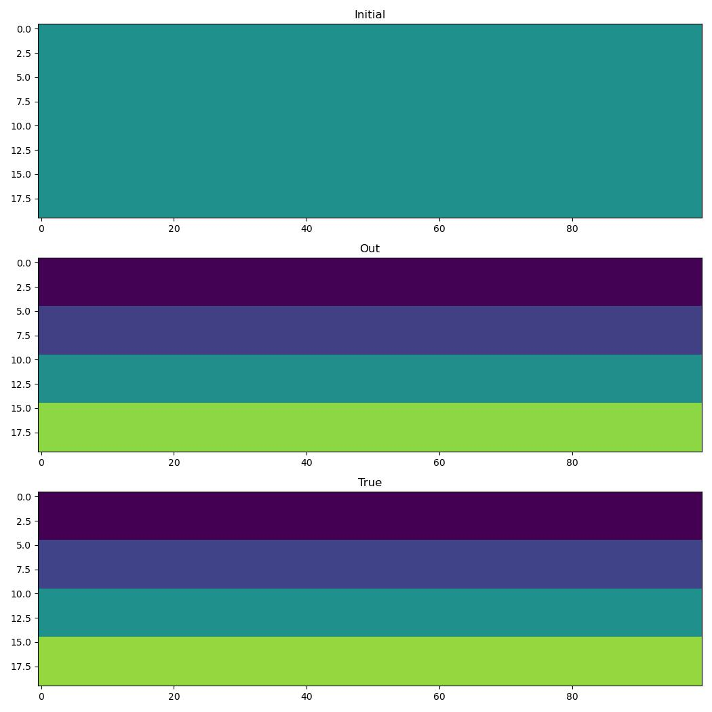

Generated model
===============

I have mentioned on several occasions that because Deepwave provides wave propagation as a PyTorch module, we can use it to include wave propagation as part of a chain of operations, and PyTorch will do forward modelling and backpropagation end-to-end. We have already seen examples of applying operations to the output of wave propagation, such as normalisation and loss functions. We have also seen examples of applying operations before wave propagation, when we used a function to generate the velocity model that was constrained to only have velocities within a specified range. In this example I will show another example of using a function to generate the velocity model.

We are going to use a function to generate a layered velocity model. When we provide it with a list of the velocities of the different layers, it will expand those to generate the model that we can then provide to Deepwave::

    class Model(torch.nn.Module):
        """A layered model generator.

        Inputs:
            layer_thickness:
                The number of cells thick each layer is in the first
                dimension
            nx:
                The number of cells of the model in the second dimension
        """
        def __init__(self, layer_thickness, nx):
            super().__init__()
            self.layer_thickness = layer_thickness
            self.nx = nx
            
        def forward(self, x):
            """Generate model.

            Inputs:
                x:
                    A Tensor of layer velocities.

            Returns:
                A layered model with the specified velocities.
            """
            return (
                x.reshape(-1, 1).repeat(1, self.layer_thickness)
                .reshape(-1, 1).repeat(1, self.nx)
            )

Let's pick some velocities to use in our "true" model::

    layer_thickness = 5
    nx = 100
    m = Model(layer_thickness, nx)

    x_true = torch.tensor([1500.0, 1600.0, 1750.0, 1920.0])
    v_true = m(x_true)

Skipping over a few bits that we have seen before, such as setting-up the sources and receivers (see the full code, linked at the bottom, if you want to look at that), we can generate observed data using this model, and then start from an initial guess model and optimise our guess to try to find a model that produces recordings that match the observed data::

    # Generate "true" observed data
    observed_data = \
        deepwave.scalar(v_true, dx, dt,
                        source_amplitudes=source_amplitudes,
                        source_locations=source_locations,
                        receiver_locations=receiver_locations,
                        pml_freq=freq)[-1]

    # Start from initial guess (all layers 1750) and try to invert
    x_init = 1750.0 * torch.ones(4)
    x = x_init.clone().requires_grad_()
    opt = torch.optim.Adam([x], lr=10.0)
    loss_fn = torch.nn.MSELoss()

    def closure():
        opt.zero_grad()
        v = m(x)
        y = deepwave.scalar(v, dx, dt,
                            source_amplitudes=source_amplitudes,
                            source_locations=source_locations,
                            receiver_locations=receiver_locations,
                            pml_freq=freq)[-1]
        loss = loss_fn(y, observed_data)
        loss.backward()
        return loss

    for i in range(100):
        opt.step(closure)

The vector `x` that we invert for is just a Tensor of four numbers. The gradients flow back into the full sized velocity model, and then further flow back into these four numbers. That means that in each iteration we calculate the derivative of the loss function with respect to each of those four numbers, and so the optimiser (the Adam method, in this case) knows how they should be changed to reduce the loss function.

The output is [1502.6620, 1595.3390, 1746.9484, 1914.4209], which is pretty close to the true values, as we can see:

`Full example code <https://github.com/ar4/deepwave/blob/master/docs/example_generated_model.py>`_
