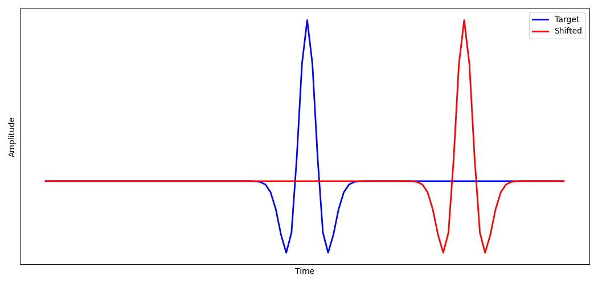
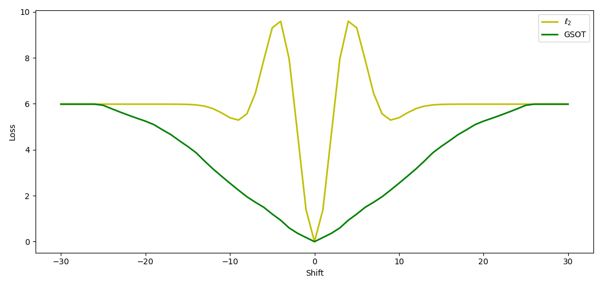
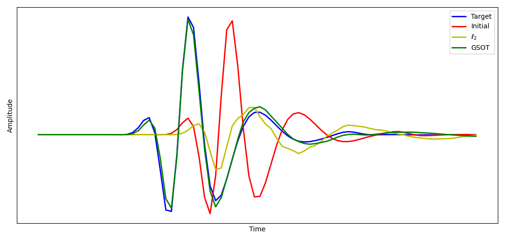

Graph Space Optimal Transport
=============================

A well-known problem with the conventional implementation of FWI is cycle-skipping. This causes inversions to get stuck in local minima when the initial velocity model is not close enough to the true model. A common approach to try to avoid cycle-skipping is to perform inversion from low to high frequencies, as we did in :doc:`an earlier example <example_fwi>`. An alternative is to use a loss/cost/objective function that is less susceptible to it. One that was recently proposed is `Graph Space Optimal Transport (GSOT) <https://dx.doi.org/10.1088/1361-6420/ab206f>`_. This does not just consider amplitude changes, like the squared error loss commonly used in FWI, but also time shifts. As a result, it reportedly has a better chance of converging to the global minimum, even when the starting model is far from the true model.

We will begin by defining a function to compute the GSOT loss between two datasets. This function calculates the cost of transforming one signal into another, considering both amplitude differences and time shifts. Most of the work in GSOT is in solving a linear sum assignment problem. The authors who proposed GSOT recommend using the auction algorithm to solve this problem with good performance, but for simplicity in this example we will use the linear sum assignment method provided by SciPy. As a result, it is quite slow, but is sufficient for the very small datasets in this example::

    def gsot(y_pred: torch.Tensor, y: torch.Tensor, eta: float):
        loss = torch.tensor(0, dtype=torch.float)
        for s in range(y.shape[0]):
            for r in range(y.shape[1]):
                nt = y.shape[-1]
                c = np.zeros([nt, nt])
                for i in range(nt):
                    for j in range(nt):
                        c[i, j] = (
                            eta * (i-j)**2 +
                            (y_pred.detach()[s, r, i]-y[s, r, j])**2
                        )
                row_ind, col_ind = linear_sum_assignment(c)
                y_sigma = y[s, r, col_ind]
                loss = (
                    loss + (
                        eta * torch.tensor(row_ind-col_ind)**2 +
                        (y_pred[s, r]-y_sigma)**2
                    ).sum()
                )
        return loss

The `eta` parameter here controls the relative sensitivity of the loss function to time shifts and amplitude changes. The authors recommend using the square of a measure of the difference in amplitudes of the current and the target signals, divided by the square of the expected time shift. The quality of the results seems to be sensitive to this parameter, so it may be necessary to experiment with it.

Note that we use `.detach()` when building the cost matrix `c` as we will not need to calculate gradients along that computation path, but we do not use `.detach()` when calculating `loss` because we will use automatic differentiation on that path when we perform FWI with this cost function.

If we compute the loss between a target signal and a shifted version of the target signal, we can see that the GSOT loss is indeed almost convex (with the chosen value of `eta`) while the traditional squared L2 norm loss has local minima.

To use GSOT for FWI, we only need to change the line that calls the loss function so that it instead calls the `gsot` function we created::

    loss = gsot(pred_data, observed_data, 0.003)

Running FWI on a simple model with a single source and receiver, we see that the squared L2 norm loss appears to fall into a local minimum. This results in it producing a velocity model that fails to produce a receiver signal that matches the target. In contrast, when we use GSOT as the loss function during the inversion, the receiver recording using the final velocity model matches almost exactly with the target.

`Full example code <https://github.com/ar4/deepwave/blob/master/docs/example_gsot.py>`_
