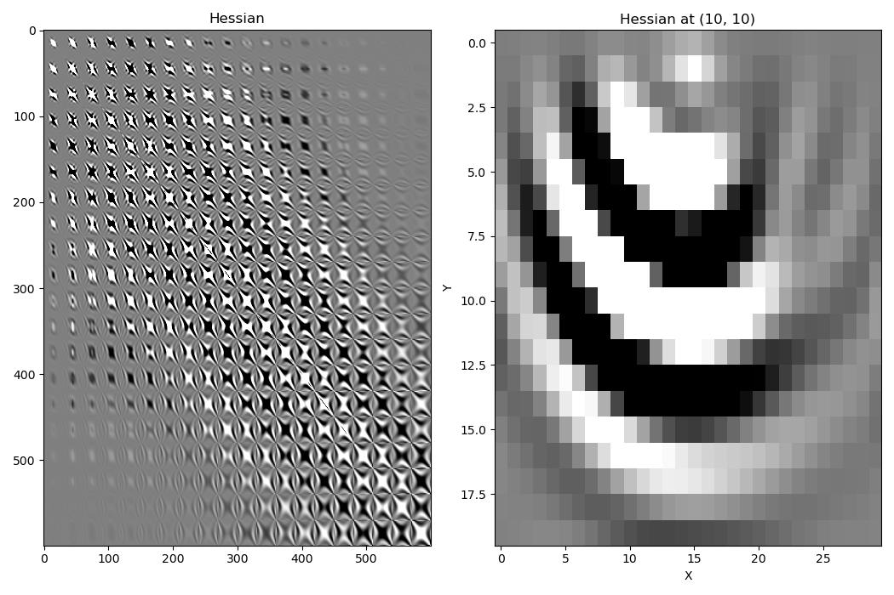
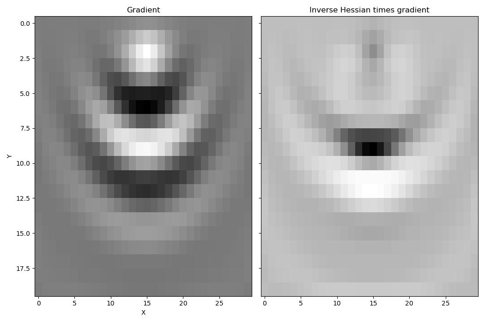
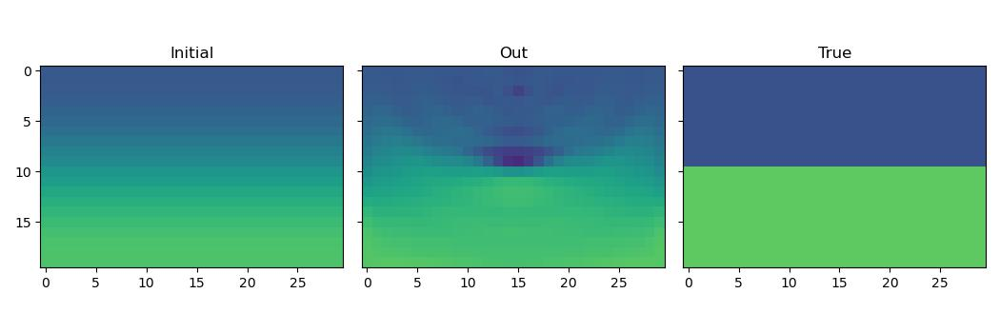

Hessian
=======

Deepwave supports backpropagating up to two times through the regular scalar propagator (but currently does not support this double backpropagation for the elastic propagator). One advantage of this is that it makes it possible to calculate Hessian matrices, which are used in optimisation methods such as `Newton-Raphson <https://en.wikipedia.org/wiki/Newton%27s_method_in_optimization>`_. I will demonstrate that in this example.

After setting up a simple two layer model with a single shot, we can calculate the gradient and Hessian of a loss function based on the output receiver data, with respect to the velocity model, using::

    def wrap(v):
        d = deepwave.scalar(
            v,
            grid_spacing=dx,
            dt=dt,
            source_amplitudes=source_amplitudes,
            source_locations=source_locations,
            receiver_locations=receiver_locations,
            pml_width=[0, 20, 20, 20],
            max_vel=2000,
        )[-1]
        return loss_fn(d, d_true)

    hess = torch.autograd.functional.hessian(wrap, v).detach()
    wrap(v).backward()
    grad = v.grad.detach()

The Hessian describes the effect that changing the velocity model at a point will have on the gradient at all points.

Taking account of these second order effects, by multiplying the gradient by the inverse of the Hessian, we get a better estimate of where we should update the model to reduce the loss function value. The gradient has high amplitude around the source, because the source has high amplitude there, but after applying the inverse Hessian the amplitudes of the gradient around the source are downweighted in favour of amplitudes near the reflector.

We can use this improved update estimate to optimise our velocity model by using the Newton-Raphson method::

    for epoch in range(3):
        hess = torch.autograd.functional.hessian(wrap, v).detach()
        wrap(v).backward()
        grad = v.grad.detach()
        eig0 = eigsh(hess.cpu().numpy().reshape(v.numel(), v.numel()),
                     k=1,
                     which="SA")[0].item()
        tau = max(-1.5 * eig0, 0)
        L = torch.linalg.cholesky(
            hess.reshape(v.numel(), v.numel()) +
            tau * torch.eye(v.numel()))
        h = torch.cholesky_solve(grad.reshape(-1, 1).neg(),
                                 L).reshape(ny, nx)
        v = (v.detach() + h).requires_grad_()

Although the result is quite good after just three iterations, the high computational cost of the Hessian (both runtime and memory) means that in many cases it might be better to use more iterations of a method that only uses the gradient.

`Full example code <https://github.com/ar4/deepwave/blob/master/docs/example_hessian.py>`_
