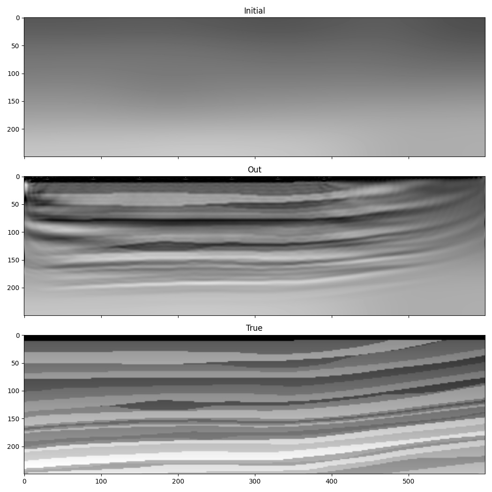

FWI from low to high frequency
==============================

One of the difficulties with FWI is that it is susceptible to "cycle skipping". A common remedy is to initially use only the low frequencies in the data, and to gradually increase the maximum frequency that is used. This example is a simple demonstration of this using Deepwave.

We saw in previous examples that it is desirable to constrain the range of velocities in the inverted model. Previous examples showed that this can be done by clipping extreme values in gradients before model updates to avoid making big velocity changes at a small number of points, or by adding a term to the cost function that penalises velocities outside our desired range. This example also demonstrates another means of achieving this.

Because PyTorch enables us to chain operators together, and will automatically backpropagate through them to calculate gradients, we can use a function to generate our velocity model. This provides us with a convenient and robust way to constrain the range of velocities in our model. We can define our velocity model to be an object containing a tensor of the same size as our model. When can call the `forward` method of this object, it returns the output of applying the sigmoid operation to this stored tensor, resulting in a value between 0 and 1 for each cell, and then scales this to our desired range. We can set the initial output of this to be our chosen initial velocity model using the `logit` operator, which is the inverse of `sigmoid`::

    class Model(torch.nn.Module):
        def __init__(self, initial, min_vel, max_vel):
            super().__init__()
            self.min_vel = min_vel
            self.max_vel = max_vel
            self.model = torch.nn.Parameter(torch.logit((initial - min_vel) /
                                                        (max_vel - min_vel)))

        def forward(self):
            return (torch.sigmoid(self.model) * (self.max_vel - self.min_vel) +
                    self.min_vel)

    model = Model(v_init, 1000, 2500).to(device)

Now, when we create the optimiser, the tensor that we will ask it to optimise is the tensor inside this object. During backpropagation, the gradient of the loss function with respect to the velocity model will be further backpropagated to calculate the gradient with respect to this tensor. We therefore won't be directly updating the velocity model, but will instead be updating this tensor that is used to generate the velocity model.

We will progress from an initial cutoff frequency in our filter of 10 Hz in the early iterations, to 30 Hz in the final iterations. To keep this example simple we will apply the frequency filter to the output of wave propagation. If you were working with very large models, you would instead probably filter the source amplitudes. A lower frequency source would allow you to use a larger grid cell spacing, reducing computational cost. To apply the frequency filter, we use a chain of second-order sections to implement a 6th order Butterworth filter with the `biquad` function from `torchaudio` and `butter` from `scipy`::

    for cutoff_freq in [10, 15, 20, 25, 30]:
        sos = butter(6, cutoff_freq, fs=1/dt, output='sos')
        sos = [torch.tensor(sosi).to(observed_data.dtype).to(device)
               for sosi in sos]

        def filt(x):
            return biquad(biquad(biquad(x, *sos[0]), *sos[1]), *sos[2])
        observed_data_filt = filt(observed_data)
        optimiser = torch.optim.LBFGS(model.parameters(),
                                      line_search_fn='strong_wolfe')
        for epoch in range(n_epochs):
            def closure():
                optimiser.zero_grad()
                v = model()
                out = scalar(
                    v, dx, dt,
                    source_amplitudes=source_amplitudes,
                    source_locations=source_locations,
                    receiver_locations=receiver_locations,
                    max_vel=2500,
                    pml_freq=freq,
                    time_pad_frac=0.2,
                )
                out_filt = filt(taper(out[-1]))
                loss = 1e6*loss_fn(out_filt, observed_data_filt)
                loss.backward()
                return loss

            optimiser.step(closure)

`Full example code <https://github.com/ar4/deepwave/blob/master/docs/example_increasing_freq_fwi.py>`_
