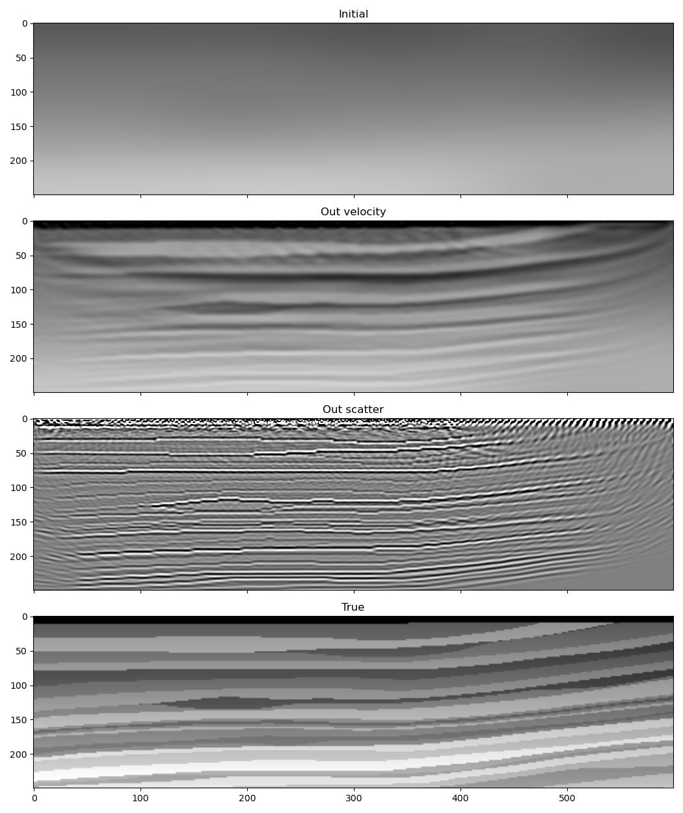

Joint Migration Inversion
=========================

**Note:** This example does not currently seem to be working properly. It becomes unstable after several iterations.

Previous examples have looked at inverting for velocity models by using the regular `scalar` wave propagator to perform FWI. Another example used the Born propagator `scalar_born` to obtain a scattering model (also known as a migrated image) with LSRTM. It is also possible to use Deepwave's Born propagator to invert for the velocity model, and even to do so at the same time as inverting for the image.

The setup is the same as in previous FWI examples, with the only difference being that we inform the optimiser that we wish to optimise both the velocity and the scattering model::

    optimiser = torch.optim.LBFGS([v, scatter], lr=1)

Then, inside the loop over epochs, we smooth the velocity and sharpen the scattering model before passing them to the propagator. This ensures that the optimiser is only able to make low wavenumber updates to the velocity model and high wavenumber updates to the scattering model. We also record receiver data at the receiver locations in both the background wavefield and the scattered wavefield, and then sum these together before comparing with the true data. This causes our predicted data to include both scattered and non-scattered waves. Our :doc:`RTM <example_rtm>` example only recorded from the scattered wavefield. The recording therefore did not include direct or refracted waves and so we needed to mask the data before computing the misfit with the true data. By also recording from the background wavefield in this example we avoid having to do that::

    for epoch in range(n_epochs):
        def closure():
            optimiser.zero_grad()
            # Remove high wavenumbers from the velocity model
            v_smooth = (
                torchvision.transforms.functional.gaussian_blur(
                    v[None], [11, 11]
                ).squeeze()
            )
            # Remove low wavenumbers from the scattering model
            scatter_sharp = scatter - (
                torchvision.transforms.functional.gaussian_blur(
                    scatter[None], [11, 11]
                ).squeeze()
            )
            out = scalar_born(
                v_smooth, scatter_sharp, dx, dt,
                source_amplitudes=source_amplitudes,
                source_locations=source_locations,
                receiver_locations=receiver_locations,
                bg_receiver_locations=receiver_locations,
                pml_freq=freq,
            )
            loss = 1e10 * loss_fn(out[-1]+out[-2], observed_data)
            loss.backward()
            return loss.item()

        optimiser.step(closure)

That's it! PyTorch and Deepwave take care of calculating the gradients correctly. When the optimisation is finished we calculate `v_smooth` and `scatter_sharp` one last time and then use these as our final models.

`Full example code <https://github.com/ar4/deepwave/blob/master/docs/example_joint_migration_inversion.py>`_
