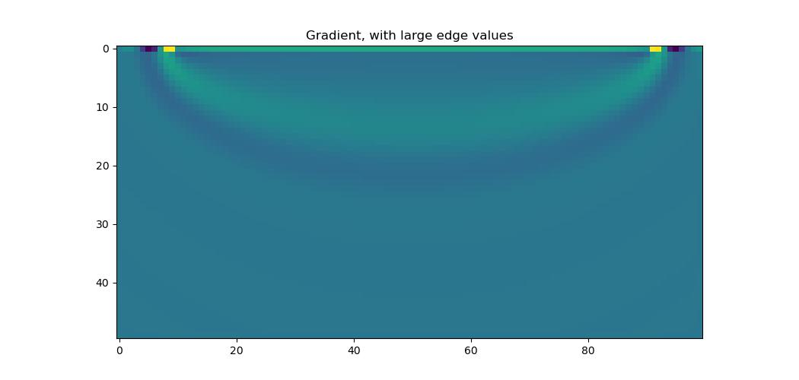
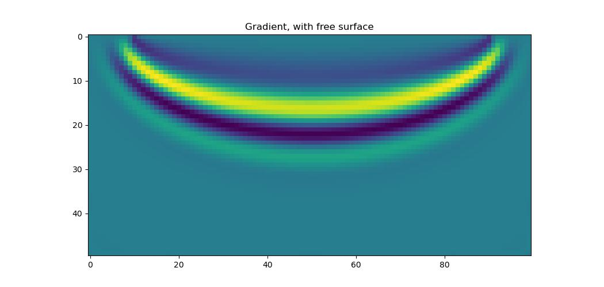
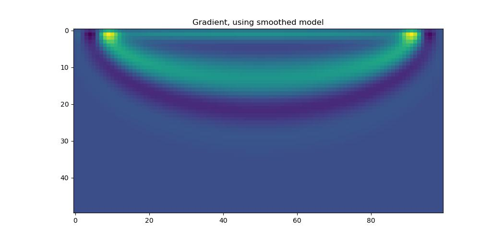
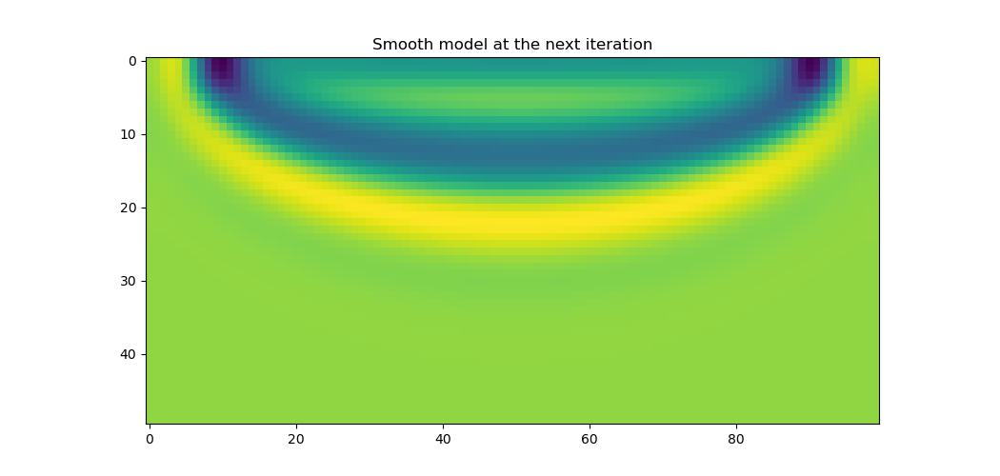

Large gradients at edges
========================

In certain circumstances the gradient calculated by Deepwave for cells at the edge of the model will be much larger than that of other cells. Let's look at an example where this occurs. I will then explain why it happens and, since it is usually undesirable, propose some ways to avoid it::

    source_amplitudes=deepwave.wavelets.ricker(25, 200, 0.004,
                                               0.06).reshape(1, 1, -1)
    source_locations=torch.tensor([[[0, 10]]])
    receiver_locations=torch.tensor([[[0, 90]]])

    v_true = 1500 * torch.ones(50, 100)
    v = 1600 * torch.ones(50, 100)
    v.requires_grad_()

    out_true = deepwave.scalar(
        v_true, grid_spacing=4, dt=0.004,
        source_amplitudes=source_amplitudes,
        source_locations=source_locations,
        receiver_locations=receiver_locations
    )[-1]

    out = deepwave.scalar(
        v, grid_spacing=4, dt=0.004,
        source_amplitudes=source_amplitudes,
        source_locations=source_locations,
        receiver_locations=receiver_locations
    )[-1]

    torch.nn.MSELoss()(out, out_true).backward()

It's a simple setup, with one source on the left and one receiver on the right, at the top surface. We generate some "true" data with a velocity of 1500 m/s, and then generate data using a model with a velocity of 1600 m/s. Calculating the MSE loss between these and backpropagating will determine the gradient of the loss with respect to the velocity model, stored in `v.grad`. Plotting it, we see that there is a line of high amplitudes, one cell thick, at the top surface.

This is caused by the absorbing PML boundary. In order for the calculated gradient to be fully correct, Deepwave includes the effect of the PML in the gradient. Some waves will travel through the PML region and reach the receiver without being fully attenuated, so there will thus be a non-zero gradient in the PML region (since changing the velocity in the PML region would affect these waves and so change the recorded data). Because Deepwave uses the velocity at the edge of the model as the velocity in the PML, these gradients from the PML region will be assigned to the cells at the edge of the model. This results in the one cell layer of large gradients at the edge of the model.

There are several ways to reduce this effect. We already saw one of them in :doc:`a previous FWI example <example_fwi>`, where we used gradient clipping to avoid having large gradients at a small number of cells. A better solution is to use a free surface at the top of the model. This is where we set the PML width there to be zero, turning it into a reflective free surface like the surface of the real earth is often modelled to be. Doing so avoids the problem, as there will now be no PML region there for waves to travel through and so no contributions to the gradient. We can achieve this by providing the optional `pml_width` parameter to Deepwave, specifying the width of the PML on each surface of the model. We only wish to make the top surface, where our source and receiver are, a free surface, so we will use a PML width of 20 cells on the other surfaces. Because of the way our model is oriented, with the top as the beginning of the first dimension, this corresponds to `pml_width=[0, 20, 20, 20]`. If instead you wish to make the beginning of the second dimension your free surface, you would use `pml_width=[20, 20, 0, 20]`::

    out_true = deepwave.scalar(
        v_true, grid_spacing=4, dt=0.004,
        source_amplitudes=source_amplitudes,
        source_locations=source_locations,
        receiver_locations=receiver_locations,
        pml_width=[0, 20, 20, 20]  # <--
    )[-1]

    out = deepwave.scalar(
        v, grid_spacing=4, dt=0.004,
        source_amplitudes=source_amplitudes,
        source_locations=source_locations,
        receiver_locations=receiver_locations,
        pml_width=[0, 20, 20, 20]  # <--
    )[-1]

    torch.nn.MSELoss()(out, out_true).backward()

The gradient now has the familiar "banana" shape.

If you do not want a free surface, there are other options. One of them is to pad the top of your model so that your sources and receivers are further from the surface and so fewer waves will pass through the PML region. This could be improved by tapering the velocity in this padded region to a smaller value as you get further from the actual model so that waves will bend towards the PML and so be less likely to reach the receivers. Another is to parameterise your model so that single layers of high amplitudes are not possible. You could, for example, apply a differentiable smoothing function (convolution with a Gaussian, for example) to your model before passing it to Deepwave. Although the gradient that comes out of Deepwave will still have the row of large amplitudes, these will get smoothed out when they are further backpropagated through the smoothing function::

    out_true = deepwave.scalar(
        v_true, grid_spacing=4, dt=0.004,
        source_amplitudes=source_amplitudes,
        source_locations=source_locations,
        receiver_locations=receiver_locations
    )[-1]

    # Smooth model
    v_smooth = (
        torchvision.transforms.functional.gaussian_blur(
            v[None], [11, 11]
        ).squeeze()
    )

    out = deepwave.scalar(
        v_smooth,  # <-- Pass smoothed model to Deepwave
        grid_spacing=4, dt=0.004,
        source_amplitudes=source_amplitudes,
        source_locations=source_locations,
        receiver_locations=receiver_locations
    )[-1]

    torch.nn.MSELoss()(out, out_true).backward()

Note that it is `v` that has `requires_grad=True`, so the gradients get backpropagated through the smoothing.

Applying the gradient and then the smoothing function to the model, to get the model that will be passed to Deepwave at the next iteration, we see that the result is smooth, as we desire.

`Full example code <https://github.com/ar4/deepwave/blob/master/docs/example_large_edge_gradient.py>`_
