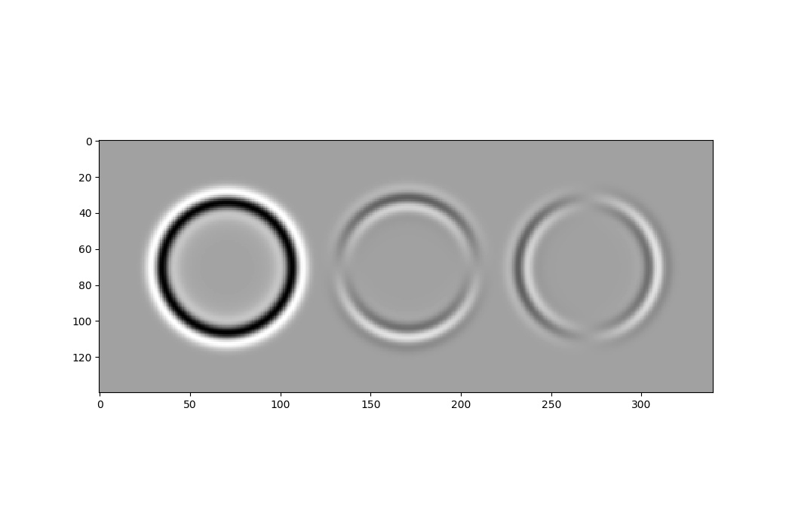
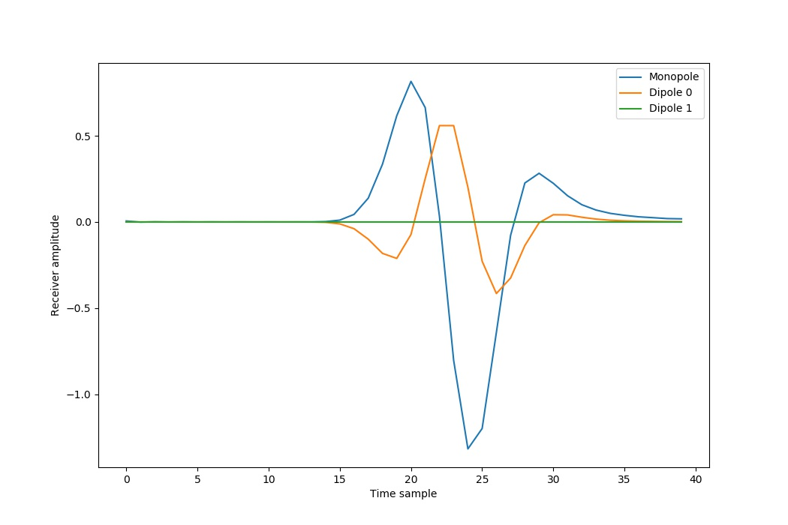
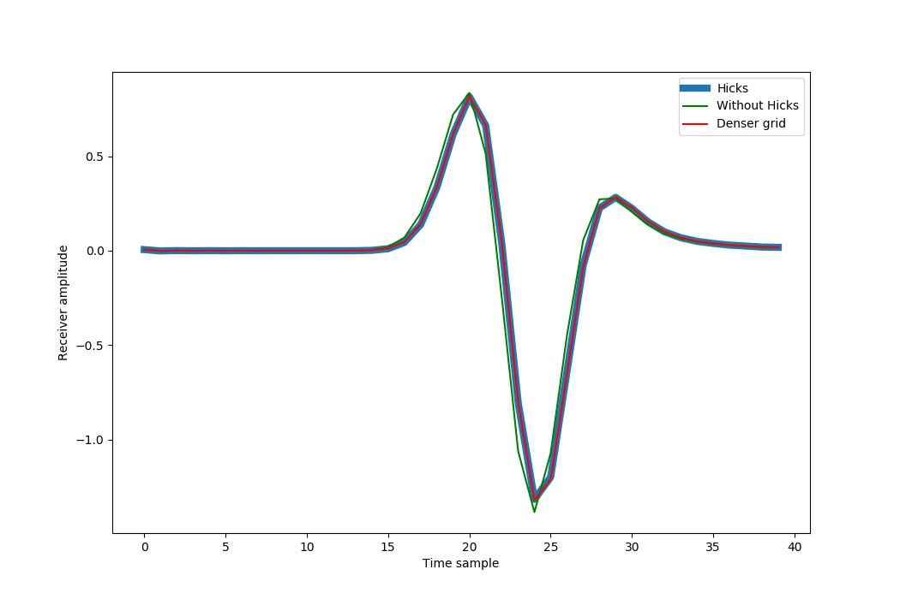

Location interpolation and dipoles
==================================

All of our examples so far have used monopole sources and receivers located on grid points. To make it easier to also use dipoles and points that are not on grid points, Deepwave provides an implementation of `a proposal by Hicks <https://doi.org/10.1190/1.1451454>`_. In this example we will see how to use it.

Previously we only used Tensors containing the locations in integer numbers of grid cells from the origin. To allow more arbitrary positions, which is especially useful when using larger grid cells (to reduce computational cost, but which might cause desired locations to no longer be on grid points), we would like to be able to specify positions with floating point numbers. Sources can only be added to, and receiver data can only be recorded from, a discretised wavefield on grid points, however. The proposal by Hicks resolves this problem by converting points at arbitrary positions into an array of points on grid cell locations. With an appropriate weighting, this array of points produces an effect similar to a point at the arbitrary floating point location.

After setting up our model in a typical way, the interesting part in this example happens when we specify the source and receiver locations. For the sources, we create three sources in a line, with none of them located on a grid point. We also set them to be a monopole, a dipole oriented in the first dimension, and a dipole oriented in the second dimension. After creating a `Hicks` object with these, we can obtain the locations and amplitudes of the array of sources that together should approximate our desired sources but that are positioned on grid points::

    source_locations = torch.zeros(1, 3, 2, device=device)
    source_locations[..., 0] = ny / 2 + 0.5
    source_locations[..., 1] = torch.arange(3) * nx / 3 + nx / 6 + 0.5
    source_monopole = torch.zeros(1, 3, dtype=torch.bool, device=device)
    source_monopole[0, 0] = True
    source_monopole[0, 1] = False
    source_monopole[0, 2] = False
    source_dipole_dim = torch.zeros(1, 3, dtype=torch.int, device=device)
    source_dipole_dim[0, 2] = 1
    hicks_source = deepwave.location_interpolation.Hicks(
        source_locations,
        monopole=source_monopole,
        dipole_dim=source_dipole_dim
    )
    hicks_source_locations = hicks_source.get_locations()
    hicks_source_amplitudes = hicks_source.source(source_amplitudes)

Similarly, we create three receivers, again a monopole and dipoles oriented in each dimension, all at the same non-grid point location above the first (monopole) source::

    receiver_locations = torch.zeros(1, 3, 2, device=device)
    receiver_locations[..., 0] = source_locations[0, 0, 0] - ny / 8
    receiver_locations[..., 1] = source_locations[0, 0, 1]
    receiver_monopole = torch.zeros(1, 3, dtype=torch.bool, device=device)
    receiver_monopole[0, 0] = True
    receiver_monopole[0, 1] = False
    receiver_monopole[0, 2] = False
    receiver_dipole_dim = torch.zeros(1, 3, dtype=torch.int, device=device)
    receiver_dipole_dim[0, 2] = 1
    hicks_receiver = deepwave.location_interpolation.Hicks(
        receiver_locations,
        monopole=receiver_monopole,
        dipole_dim=receiver_dipole_dim
    )
    hicks_receiver_locations = hicks_receiver.get_locations()

We can then simply pass these arrays of sources and receivers to the Deepwave propagator as usual::

    out = scalar(v, dx, dt, source_amplitudes=hicks_source_amplitudes,
                 source_locations=hicks_source_locations,
                 receiver_locations=hicks_receiver_locations,
                 pml_freq=freq)

In the wavefield of the final time step of this propagation, we can see the three types of source.

Just as we used the `source` function of the `Hicks` object to convert the source amplitudes of our original point sources into the amplitudes for the array of grid-centred sources, we can use the `receiver` function to convert the receiver amplitudes recorded at the locations of the array of grid-centred receivers into the amplitudes that we would have recorded if we could have receivers at our desired non-grid-centred receiver locations::

    receiver_hicks_amplitudes = out[-1]
    receiver_amplitudes = hicks_receiver.receiver(receiver_hicks_amplitudes)

Plotting these, we see how the three different types of receivers respond differently to the arrivals from the monopole source, even though all three receivers are located in the same place:

To verify the accuracy of the Hicks method, we can perform the same propagation but with the source and receiver locations rounded to a grid point, and also perform it on a grid with half the grid cell spacing so that our desired locations are on grid points. When we halve the grid spacing in both dimensions, we also need to multiply the source amplitudes by four to produce a similar effect on the wavefield::

    out2 = scalar(v, dx, dt,
                  source_amplitudes=source_amplitudes,
                  source_locations=source_locations.long(),
                  receiver_locations=receiver_locations.long(),
                  pml_freq=freq)

    v = torch.ones(2 * ny, 2 * nx, device=device) * 1500
    out3 = scalar(v, dx / 2, dt,
                  source_amplitudes=source_amplitudes*4,
                  source_locations=(source_locations*2).long(),
                  receiver_locations=(receiver_locations*2).long(),
                  pml_freq=freq)

We see that simply rounding to grid points does change the result noticeably in this case, while the Hicks method has very well approximated the result that we get with a denser grid:

The approximation may not be as good close to the point (such as within the array), so, if you are performing optimisation, you may wish to apply a mute to receivers that are close to sources when using the Hicks method.

Finally, it is important to note that if your desired non-grid-point locations are near an edge of the model, you might need to extend the model (such as by using `torch.nn.functional.pad` with `mode='replicate'`). This is because the array of grid-centred points produced by the Hicks method will surround the desired location and so some might be positioned outside the current model. If you do this, and extend the edge at the beginning of a dimension, then you will also need to shift the locations to account for the shift in origin of the model. For example, if you wish to have a point at `[0.1, 1.1]` and you use the default Hicks option of a halfwidth of 4, then you will need to pad the beginnings of both dimensions (by three and two, respectively) so that all locations are at least 0::

    source_locations = torch.tensor([[[0.1, 1.1]]])
    hicks = deepwave.location_interpolation.Hicks(source_locations)
    hicks_source_locations = hicks.get_locations()
    hicks_source_locations[..., 0] += 3
    hicks_source_locations[..., 1] += 2
    model = torch.nn.functional.pad(model[None], (3, 2), mode='replicate')[0]

If you specify an edge as being a free surface, however, then the array of points will not extend beyond that edge.

`Full example code <https://github.com/ar4/deepwave/blob/master/docs/example_location_interpolation.py>`_
