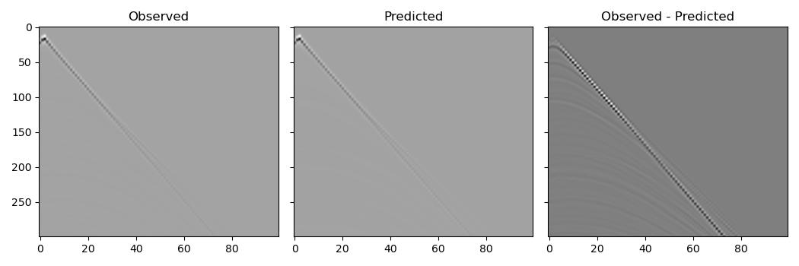
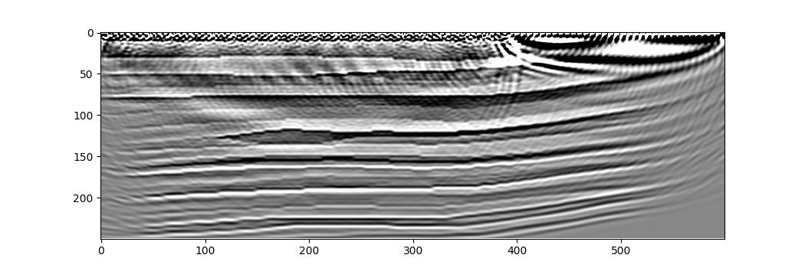

Least-Squares Reverse-Time Migration (LSRTM)
============================================

This example demonstrates inversion for the scattering potential with Born modelling, commonly known as imaging or migration.

The code is very similar to that used in :doc:`the FWI example <example_fwi>`. We load the Marmousi 1 velocity model and smooth it to use as the migration velocity model, load the data generated in :doc:`the forward modelling example <example_forward_model>`, and then perform iterative optimisation, repeatedly running forward modelling and backpropagation to calculate the gradients and update our model. The main differences are that now we use the Born propagator and we invert for the scattering model rather than the velocity. Let's focus on these changes.

Born modelling propagates a wavefield in a "background" velocity model. This wavefield interacts with a provided scattering potential at each time step to produce a source term for a second wavefield. This second wavefield, the scattered wavefield, is also propagated using the background velocity model, and it is from this scattered wavefield that receivers record their data. The recorded data will therefore only contain singly-scattered waves, while the observed dataset also contains strong direct arrivals. Trying to get Born modelling to match these direct arrivals would cause strong artefacts. There are multiple ways to handle this. The one we will use in this example is to model these direct arrivals by forward modelling through our smooth migration velocity model using the regular (non-Born) propagator and then subtract them from the observed dataset before we use it in inversion::

    out = scalar(
        v_mig, dx, dt,
        source_amplitudes=source_amplitudes,
        source_locations=source_locations,
        receiver_locations=receiver_locations,
        pml_freq=freq,
        accuracy=8,
        max_vel=v_true.max(),
    )
    observed_scattered_data = observed_data - out[-1]

Note that we specified the `max_vel` parameter to be the maximum velocity in the true velocity model. This will cause Deepwave's internal time step size to be the same as when `observed_data` was created, to get a better match between the two datasets (and so fuller cancellation of the direct arrivals). From the results we see that subtracting this estimate of the direct arrivals successfully attenuates them relative to the scattered arrivals.

We now run the optimisation to invert for the scattering potential. To do this we create an initial scattering model (which is all zeros), specify that gradients will need to be calculated with respect to it, and then iteratively optimise it so that the output of Born propagation matches the observed scattered data::

    # Create scattering amplitude that we will invert for
    scatter = torch.zeros_like(v_mig)
    scatter.requires_grad_()

    # Setup optimiser to perform inversion
    optimiser = torch.optim.LBFGS([scatter])
    loss_fn = torch.nn.MSELoss()

    # Run optimisation/inversion
    n_epochs = 3

    for epoch in range(n_epochs):
        def closure():
            optimiser.zero_grad()
            out = scalar_born(
                v_mig, scatter, dx, dt,
                source_amplitudes=source_amplitudes,
                source_locations=source_locations,
                receiver_locations=receiver_locations,
                pml_freq=freq,
            )
            loss = 1e6 * loss_fn(out[-1], observed_scattered_data)
            loss.backward()
            return loss.item()

        optimiser.step(closure)

This produces the following image (note again that the result is worse on the right because there are no sources there).

`Full example code <https://github.com/ar4/deepwave/blob/master/docs/example_lsrtm.py>`_
