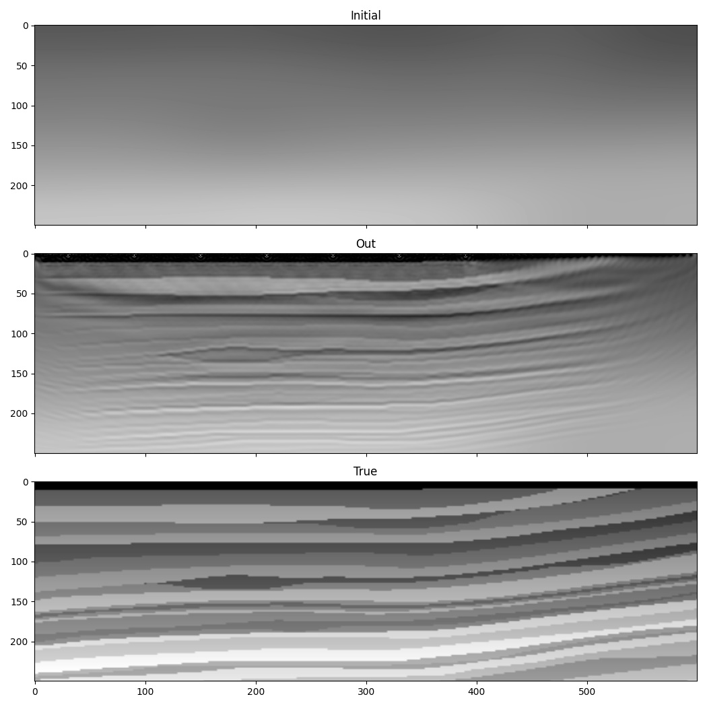

FWI with amplitude normalisation
================================

In :doc:`the previous example <example_simple_fwi>` we used Deepwave to perform Full-Waveform Inversion. One of the simplifications that we used was that we didn't need to normalise the data. This is because we knew the source amplitudes exactly, and we used a similar propagator to generate the target and predicted recordings, so the receiver amplitudes should have matched if we got the velocity model right. That is not generally the case in more realistic situations. This example is thus a small modification to include normalisation so that only relative amplitudes are used when calculating the loss. To perform this normalisation we will divide the predicted and target datasets by their RMS amplitude.

The first change that we need to make is to scale the observed data. This only needs to be done once, so we can do it outside the optimisation iteration loop::

    observed_data /= (observed_data**2).mean().sqrt().item()

We could also calculate a scaling value for the predicted data outside the optimisation loop and then apply the same scaling each time, perhaps by calculating the RMS amplitude of the predicted data in our starting model, but in this example we are going to calculate a new scaling value for each iteration. We do this by calculating the RMS amplitude of the predicted data in each iteration, and dividing by it so that our predicted and target datasets both have an RMS amplitude of 1 before we compare them in the loss function::

    out = scalar(
        v, dx, dt,
        source_amplitudes=source_amplitudes,
        source_locations=source_locations,
        receiver_locations=receiver_locations,
        pml_freq=freq,
    )
    predicted = out[-1]
    predicted_norm = (predicted.detach()**2).mean().sqrt().item()
    if predicted_norm > 0:
        normed_predicted = predicted / predicted_norm
    else:
        normed_predicted = predicted

I `detached <https://pytorch.org/docs/stable/generated/torch.Tensor.detach.html>`_ the predicted tensor when calculating the scaling value because we only want the scaled values in the loss function to be used when calculating the gradient.

This is an example (albeit a very simple one) of incorporating wave propagation into a chain of differentiable operations and letting PyTorch backpropagate through all of them. The normalisation operation we created is now applied to the output of the wave propagator before the loss function. We could just as easily apply more operations before and after wave propagation, potentially with new tensors that we can invert for.

We could now use `normed_predicted` in the loss function, with the target `observed_data` that we have already scaled, and not make any other changes compared to :doc:`the previous example <example_simple_fwi>`. I will, however, use this opportunity to demonstrate another change. In :doc:`the previous example <example_simple_fwi>` we clipped the gradients to reduce the difference between the gradients around the sources and receivers and the rest of the model. Without such clipping, the inversion can become unstable as the large gradients cause the range of velocities to become large, with velocities in some grid cells so small that the number of wavelengths per grid cell is too small for accurate wave propagation. Another approach to avoiding this is to add new terms to the loss function that penalise velocity values outside the desired range. This could take multiple forms, with one simple one being::

    lower_mask = torch.nn.functional.relu(-(v.detach()-1200))
    upper_mask = torch.nn.functional.relu(v.detach()-6000)
    loss = (1e6*loss_fn(normed_predicted, observed_data) +
            (((v-1200)**2)*lower_mask).mean() +
            (((v-6000)**2)*upper_mask).mean())
    loss.backward()

Here we create masks, using the ReLU operation, to select cells where the velocity is outside our desired range of between 1200 and 6000 m/s. We then add new terms to the loss function that increase as the velocity departs from this range. As usual when combining terms in a loss function, you need to weight them so that their effect on the loss is balanced.

Notice that our new loss function terms do not depend on the output of our wave propagation. The gradients associated with those terms will thus not need to backpropagate through the wave propagator, but PyTorch will take care of backpropagating them correctly.

These changes, combined with changing our optimiser to LBFGS applied for five epochs, result in a similar inversion to the previous example:

The cost function that we used in this example encourages the optimiser to keep the velocities within the desired range, but does not force it to be the case. It is thus likely that the velocities will sometimes exceed the limits (if you run this example, you will get warnings about too few samples per wavelength for some iterations). The method for containing velocity within a range that is used in :doc:`the next example <example_increasing_freq_fwi>` is thus superior, and the one used in this example is mainly included as a demonstration of a cost function with multiple terms.

Because of the normalisation we used this time, the result should also be the same even if we had scaled the observed data by a large number before running our code.

`Full example code <https://github.com/ar4/deepwave/blob/master/docs/example_normalised_fwi.py>`_
