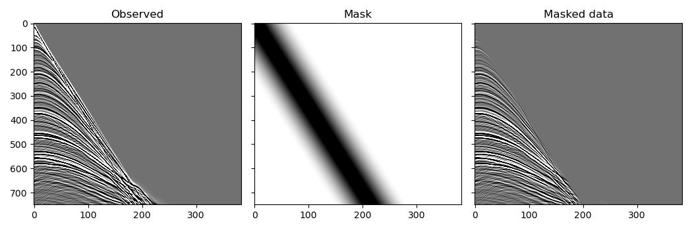

Reducing memory usage by accumulating gradients over batches
============================================================

In the previous examples we propagated all of the shots simultaneously. This is simple, and can improve performance by running shots in parallel, but for large datasets might require more memory than is available. To reduce the amount of memory required while getting identical results, we can instead propagate batches of shots and accumulate the gradients over all of the batches before taking a step with the optimiser. To demonstrate this we will again perform imaging with the Marmousi data, but this time we will use the entire model and dataset, which we probably wouldn't have enough memory to do if we propagated all of the shots simultaneously as in the previous example.

But first we will do something that is unrelated to reducing memory requirements or using batches: we will use this example to also demonstrate another method of preventing artefacts in the migrated image caused by direct arrivals, using a mask that attempts to attenuate them. To avoid introducing high frequencies into the data with a sharp cut-off, we use a tapered mute for the mask::

    mask = torch.ones_like(observed_data)
    flat_len = 100
    taper_len = 200
    taper = torch.cos(torch.arange(taper_len)/taper_len * math.pi/2)
    mute_len = flat_len + 2*taper_len
    mute = torch.zeros(mute_len, device=device)
    mute[:taper_len] = taper
    mute[-taper_len:] = taper.flip(0)
    v_direct = 1700
    for shot_idx in range(n_shots):
        sx = (shot_idx * d_source + first_source) * dx
        for receiver_idx in range(n_receivers_per_shot):
            rx = (receiver_idx * d_receiver + first_receiver) * dx
            dist = abs(sx - rx)
            arrival_time = dist / v_direct / dt
            mute_start = int(arrival_time) - mute_len//2
            mute_end = mute_start + mute_len
            if (mute_start > nt):
                continue
            actual_mute_start = max(mute_start, 0)
            actual_mute_end = min(mute_end, nt)
            mask[shot_idx, receiver_idx,
                 actual_mute_start:actual_mute_end] = \
                mute[actual_mute_start-mute_start:
                     actual_mute_end-mute_start]
    observed_scatter_masked = observed_data * mask

We now run the optimisation to invert for the scattering potential. This is similar to previous examples, except that we forward and backpropagate batches of shots. Each time we backpropagate, PyTorch will add to the existing gradient values. Since we zero the gradients before this loop over shot batches, not during it, the gradient contributions from all of the shots will accumulate, and so at the end the gradients should be the same as they would have been if we had propagated all of the shots simultaneously. We then tell the optimiser to use this gradient to take a step after the loop over shot batches has completed, so there should be no change in the update or in the final result due to the use of batches. We could also have used a `PyTorch data loader <https://pytorch.org/docs/stable/data.html>`_ to split the data into batches instead of doing it ourselves, with equivalent results::

    # Create scattering amplitude that we will invert for
    scatter = torch.zeros_like(v_mig)
    scatter.requires_grad_()

    # Setup optimiser to perform inversion
    optimiser = torch.optim.SGD([scatter], lr=1e9)
    loss_fn = torch.nn.MSELoss()

    # Run optimisation/inversion
    n_epochs = 1
    n_batch = 46  # The number of batches to use
    n_shots_per_batch = (n_shots + n_batch - 1) // n_batch
    for epoch in range(n_epochs):
        epoch_loss = 0
        optimiser.zero_grad()
        for batch in range(n_batch):
            batch_start = batch * n_shots_per_batch
            batch_end = min(batch_start + n_shots_per_batch,
                            n_shots)
            if batch_end <= batch_start:
                continue
            s = slice(batch_start, batch_end)
            out = scalar_born(
                v_mig, scatter, dx, dt,
                source_amplitudes=source_amplitudes[s],
                source_locations=source_locations[s],
                receiver_locations=receiver_locations[s],
                pml_freq=freq
            )
            loss = (
                loss_fn(out[-1] * mask[s],
                        observed_scatter_masked[s])
            )
            epoch_loss += loss.item()
            loss.backward()
        print(epoch_loss)
        optimiser.step()

The resulting image is already quite good after just one iteration (RTM instead of LSRTM). Additional iterations of the optimiser might improve it, but might also require more careful setup for the optimisation to converge to a desirable output.

.. image:: example_rtm.jpg

This example discussed splitting the dataset into batches of shots to reduce memory requirements while still getting the same result as if all of the shots were propagated simultaneously (getting the gradients with respect to the entire dataset before taking a step with the optimiser). It might take less time to converge, however, to instead take a step with the optimiser after every batch or after every small number of batches, using randomly selected shots in each batch. This is the way training is typically done when training neural networks, and so is easy to set up (it can be as simple as moving `optimiser.zero_grad()` and `optimiser.step()` inside the loop over batches in the above code).

`Full example code <https://github.com/ar4/deepwave/blob/master/docs/example_rtm.py>`_
