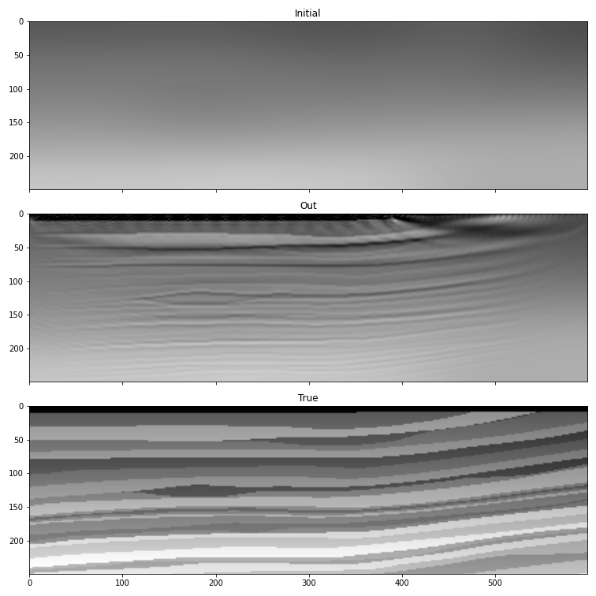

Full-Waveform Inversion of a portion of Marmousi
================================================

Full-Waveform Inversion provides the potential to invert for a model that matches the whole wavefield, including refracted arrivals. It performs inversion using the regular propagator rather than the Born propagator.

We continue with using the Marmousi model, but due to the computational cost of running many iterations of FWI, we will work on only a portion of it::

    import torch
    from scipy.ndimage import gaussian_filter
    import matplotlib.pyplot as plt
    import deepwave
    from deepwave import scalar

    device = torch.device('cuda' if torch.cuda.is_available() else 'cpu')
    ny = 2301
    nx = 751
    dx = 4.0
    v_true = torch.from_file('marmousi_vp.bin',
                             size=ny*nx).reshape(ny, nx)

    # Select portion of model for inversion
    ny = 600
    nx = 250
    v_true = v_true[:ny, :nx]

We smooth the true model to create our initial guess of the wavespeed, which we will attempt to improve with inversion. We also load the data that we generated in :doc:`the forward modelling example <example_forward_model>` to serve as our target observed data::

    v_init = torch.tensor(1/gaussian_filter(1/v_true.numpy(), 40)).to(device)
    v = v_init.clone()
    v.requires_grad_()

    n_shots = 115

    n_sources_per_shot = 1
    d_source = 20  # 20 * 4m = 80m
    first_source = 10  # 10 * 4m = 40m
    source_depth = 2  # 2 * 4m = 8m

    n_receivers_per_shot = 384
    d_receiver = 6  # 6 * 4m = 24m
    first_receiver = 0  # 0 * 4m = 0m
    receiver_depth = 2  # 2 * 4m = 8m

    freq = 25
    nt = 750
    dt = 0.004
    peak_time = 1.5 / freq

    observed_data = (
        torch.from_file('marmousi_data.bin',
                        size=n_shots*n_receivers_per_shot*nt)
        .reshape(n_shots, n_receivers_per_shot, nt)
    )

As our model is now smaller, we also need to extract only the portion of the observed data that covers this section of the model::

    n_shots = 20
    n_receivers_per_shot = 100
    nt = 300
    observed_data = observed_data[:n_shots, :n_receivers_per_shot, :nt].to(device)

We set-up the sources and receivers as before::

    # source_locations
    source_locations = torch.zeros(n_shots, n_sources_per_shot, 2,
                                   dtype=torch.long, device=device)
    source_locations[..., 1] = source_depth
    source_locations[:, 0, 0] = torch.arange(n_shots) * d_source + first_source

    # receiver_locations
    receiver_locations = torch.zeros(n_shots, n_receivers_per_shot, 2,
                                     dtype=torch.long, device=device)
    receiver_locations[..., 1] = receiver_depth
    receiver_locations[:, :, 0] = (
        (torch.arange(n_receivers_per_shot) * d_receiver + first_receiver)
        .repeat(n_shots, 1)
    )

    # source_amplitudes
    source_amplitudes = (
        (deepwave.wavelets.ricker(freq, nt, dt, peak_time))
        .repeat(n_shots, n_sources_per_shot, 1).to(device)
    )

We are now ready to run the optimiser to perform iterative inversion of the wavespeed model. We apply a scaling to boost the gradient values to a range that will help us to make good progress with each iteration, but also apply a clipping to the gradients to avoid making very large changes at a small number of points (such as around the sources)::

    # Setup optimiser to perform inversion
    optimiser = torch.optim.SGD([v], lr=0.1, momentum=0.9)
    loss_fn = torch.nn.MSELoss()

    # Run optimisation/inversion
    n_epochs = 250
    v_true = v_true.to(device)

    for epoch in range(n_epochs):
        def closure():
            optimiser.zero_grad()
            out = scalar(
                v, dx, dt,
                source_amplitudes=source_amplitudes,
                source_locations=source_locations,
                receiver_locations=receiver_locations,
                pml_freq=freq,
            )
            loss = 1e10 * loss_fn(out[-1], observed_data)
            loss.backward()
            torch.nn.utils.clip_grad_value_(
                v,
                torch.quantile(v.grad.detach().abs(), 0.98)
            )
            return loss

        optimiser.step(closure)

The result is quite a good improvement in the accuracy of our estimate of the wavespeed model.

This is a simple implementation of FWI. Faster convergence and greater robustness in more realistic situations can be achieved with modifications such as a more sophisticated loss function. As PyTorch will automatically backpropagate through any differentiable operations that you apply to the output of Deepwave, you only have to specify the forward action of such loss functions and can then let PyTorch automatically handle the backpropagation.

`Full example code <https://github.com/ar4/deepwave/blob/master/docs/example_simple_fwi.py>`_
