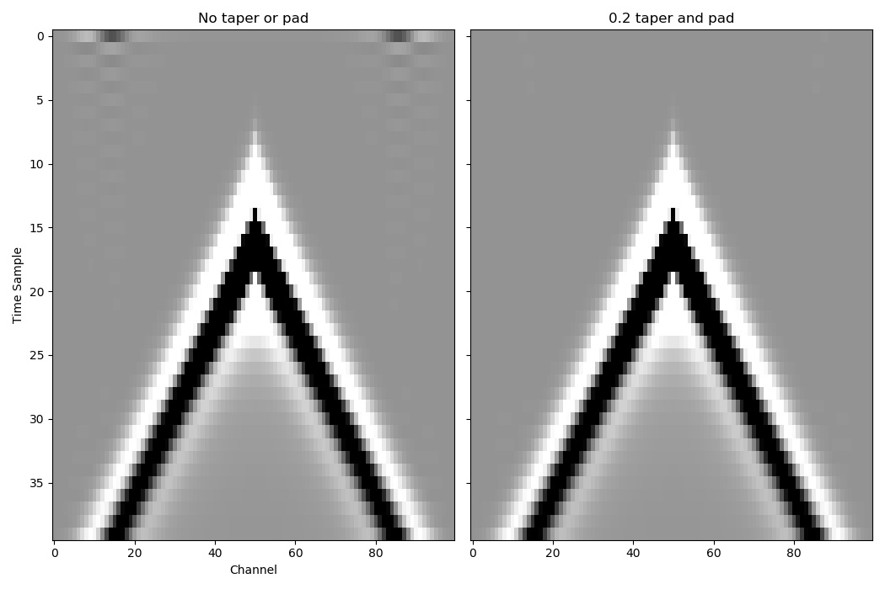

Frequency tapering and time padding
===================================

In order to obey the `CFL condition <https://en.wikipedia.org/wiki/Courant%E2%80%93Friedrichs%E2%80%93Lewy_condition>`_, Deepwave may need to upsample the source amplitudes and then downsample the receiver amplitudes. This is done in a way that avoids introducing higher frequencies, since the sampling of the integral for calculating the model gradient relies on the forward and adjoint waves being band-limited. Possible consequences of this are wraparound and ringing. These are particularly likely when a high amplitude arrival is truncated, such as when a receiver recording ends while the receiver is still in the middle of recording the direct arrival. For cases where wraparound and ringing are a problem, for example when you want to create clean forward-modelled data, Deepwave provides the option of applying frequency tapering and time padding during resampling.

Sharp changes in the amplitude of signals in the frequency domain cause ringing. Upsampling in Deepwave results in zero amplitude frequencies being added above the maximum frequency in the original signal. Large amplitudes near the Nyquist frequency of the original signal will therefore result in a sharp change to zero after upsampling, which is likely to produce ringing. Similarly, downsampling discards high frequencies in the original signal. Even if the frequency spectrum was smooth before downsampling, if it was non-zero at the Nyquist frequency of the downsampled signal there will be a discontinuity after downsampling and so possible ringing. Tapering the frequencies to zero at the Nyquist frequency before upsampling and after downsampling can thus reduce these sharp changes that cause ringing.

The resampling process can cause wraparound, so non-zero amplitudes at one end of the signal can cause non-zero amplitudes to appear at the other end of the signal. By padding the signal in time before resampling, and then discarding the padded samples, this wraparound can be reduced.

We can see this feature in action by propagating a wave for only a small number of time steps so that the direct arrival has not yet completely passed all of the receivers. The recordings of some receivers thus end while they are still in the process of recording the direct arrival, causing their recordings to end on a large amplitude. As discussed above, this causes artifacts to appear at the beginning of those traces. The ideal solution is to record for longer so that the wavefield has returned to zero before ending the recording, but if that is not possible then we can instead apply frequency tapering and time padding to reduce the artifacts::

    out = scalar(v, dx, dt, source_amplitudes=source_amplitudes,
                 source_locations=source_locations,
                 receiver_locations=receiver_locations,
                 pml_freq=freq,
                 freq_taper_frac=0.2,
                 time_pad_frac=0.2)

`Full example code <https://github.com/ar4/deepwave/blob/master/docs/example_taper_and_pad.py>`_
