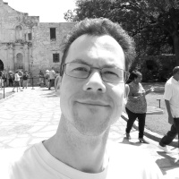

Matching a target final wavefield and saving snapshots
======================================================

In addition to calculating the gradient with respect to the velocity model of a loss function involving the receiver amplitudes, Deepwave can also calculate gradients involving any of the propagation outputs with respect to any of the float tensor inputs. So the Born scalar propagator, for example, supports calculating gradients not only with respect to the scattering potential, but also with respect to the velocity model and source. This can involve multiple inputs and outputs of a propagation simultaneously, so you can calculate the gradient with respect to multiple inputs (say velocity and source amplitudes) of a loss function that involves multiples outputs (such as receiver amplitudes and final wavefield amplitudes).

In previous examples we have seen several demonstrations of typical optimisations of the velocity model or scattering potential to reduce the difference between predicted and observed data. This time, let's optimise source amplitudes to make the final wavefield match a target.

We will use this image as a target:

We can load it using::

    target = torchvision.io.read_image(
        'target.jpg',
        torchvision.io.ImageReadMode.GRAY
    ).float()/255
    target = (target[0] - target.mean()).to(device)

Let's create `n_sources_per_shot` sources located at random cells, without more than one at the same location::

    source_locations = torch.zeros(n_shots, n_sources_per_shot, 2,
                                   dtype=torch.long, device=device)
    torch.manual_seed(1)
    grid_cells = torch.cartesian_prod(torch.arange(ny), torch.arange(nx))
    source_cell_idxs = torch.randperm(len(grid_cells))[:n_sources_per_shot]
    source_locations = (grid_cells[source_cell_idxs]
                        .reshape(1, n_sources_per_shot, 2)).long().to(device)

The next step is to then create the initial source amplitudes and specify that we want to calculate gradients with respect to them::

    source_amplitudes = (
        deepwave.wavelets.ricker(freq, nt, dt, peak_time)
        .repeat(n_shots, n_sources_per_shot, 1).to(device)
    )
    source_amplitudes.requires_grad_()

    optimiser = torch.optim.LBFGS([source_amplitudes])

The optimisation loop is then not very dissimilar to earlier examples. We'll set the PML width to be zero on all sides so that waves reflect from the edges of the model. The loss function measures the difference between the final wavefield and the target image, and also penalises the norm of the source amplitudes to find the minimum norm solution::

    def closure():
        optimiser.zero_grad()
        out = deepwave.scalar(v, dx, dt,
                              source_amplitudes=source_amplitudes,
                              source_locations=source_locations,
                              pml_width=0)
        y = out[0][0]
        loss = loss_fn(y, target) + 1e-4*source_amplitudes.norm()
        loss.backward()
        return loss

    for i in range(50):
        optimiser.step(closure)

Lastly, we will save the wave propagation time steps so that we can make them into an animated GIF. We want to save every time step, so we will create a loop over time steps. When we call the wave propagator, we only want it to advance by one time step. We can achieve this by calling the propagator with each time sample of the source amplitudes. As we discussed in :doc:`the checkpointing example <example_checkpointing>`, however, that might not give us exactly the result that we want due to upscaling within Deepwave to obey the CFL condition. We therefore perform the upscaling ourselves and then call the propagator with chunks of the upscaled source amplitudes that correspond to one time step before upscaling::

    dt, step_ratio = deepwave.common.cfl_condition(dx, dx, dt, 2000)
    source_amplitudes = deepwave.common.upsample(source_amplitudes, step_ratio)

    target_abs_max = target.abs().max()
    for i in range(nt):
        chunk = source_amplitudes[..., i*step_ratio:(i+1)*step_ratio]
        if i == 0:
            out = deepwave.scalar(v, dx, dt,
                                  source_amplitudes=chunk,
                                  source_locations=source_locations,
                                  pml_width=0)
        else:
            out = deepwave.scalar(v, dx, dt,
                                  source_amplitudes=chunk,
                                  source_locations=source_locations,
                                  pml_width=0,
                                  wavefield_0=out[0],
                                  wavefield_m1=out[1],
                                  psiy_m1=out[2],
                                  psix_m1=out[3],
                                  zetay_m1=out[4],
                                  zetax_m1=out[5])
        val = out[0][0] / target_abs_max / 2 + 0.5
        torchvision.utils.save_image(val, f'wavefield_{i:03d}.jpg')

Using `FFmpeg <https://ffmpeg.org>`_ to join these individual time steps into an animated GIF::

    ffmpeg -i wavefield_%03d.jpg -framerate 30 example_target_wavefield.gif

we obtain the result:

.. image:: example_target_wavefield.gif

`Full example code <https://github.com/ar4/deepwave/blob/master/docs/example_target_wavefield.py>`_
