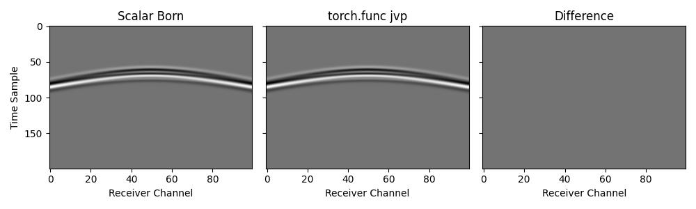
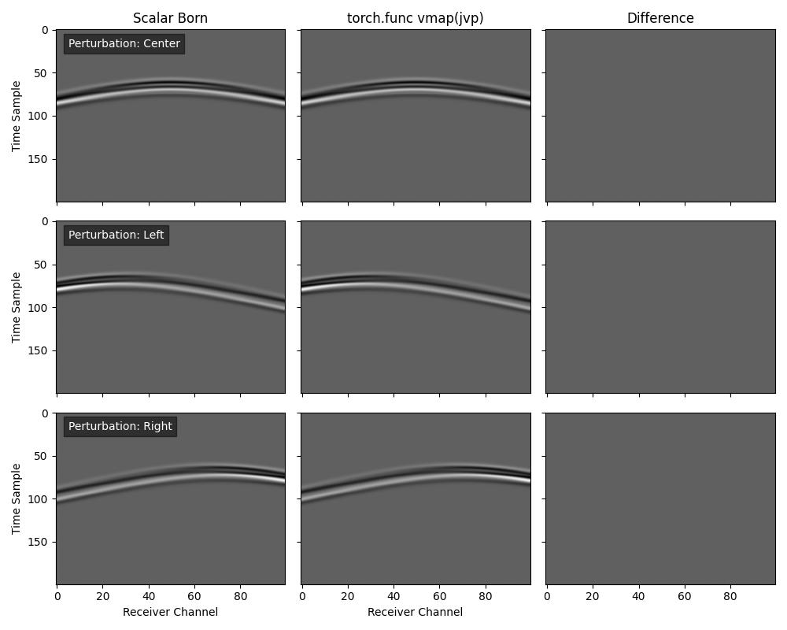

Using torch.func features
=========================

Deepwave supports using `torch.func` features, such as `vmap` (vectorizing map) and forward-mode automatic differentiation (AD), to perform batch processing and sensitivity analysis. This allows for functional transformations of the wave propagation.

However, there are significant constraints and performance considerations when using these features with Deepwave:

*   **Property Models Only:** `torch.func` transformations can currently only be applied to property models (e.g., velocity, scattering potential). They cannot be applied to source amplitudes or source/receiver locations.
*   **Eager Backend Only:** These features are only compatible with the pure Python backend of Deepwave. You must specify `python_backend="eager"` in the propagator call. This backend is **substantially slower** than the default C/CUDA backend.
*   **max_vel Required:** You must explicitly specify the `max_vel` parameter. When using `vmap`, the code cannot inspect the values of the velocity models to determine the maximum velocity for the CFL condition (calculating the time step).
*   **Native Batching Preferred:** Deepwave already has native support for batched property models. If your goal is simply to propagate a batch of models, the native C/CUDA backend (which handles batch dimensions automatically) will be much faster than using `vmap` with the eager backend. `torch.func` is primarily useful for more advanced use cases.

Forward-Mode AD for Scattering (Jacobian-Vector Product)
--------------------------------------------------------

We can use `torch.func.jvp` to compute the scattered wavefield (the linearized response) due to a perturbation in the velocity model. This is mathematically equivalent to the Born approximation. In this example, we verify that the output of `jvp` applied to the nonlinear `scalar` propagator matches the output of the explicit `scalar_born` propagator.

First, we define a wrapper for the simulation that fixes the arguments we are not differentiating with respect to, and ensures the necessary constraints (eager backend and explicit `max_vel`) are met::

    def forward_sim(v):
        # Note: We must specify `max_vel` and `python_backend="eager"`
        return deepwave.scalar(
            v,
            dx,
            dt,
            source_amplitudes=source_amplitudes,
            source_locations=source_locations,
            receiver_locations=receiver_locations,
            pml_freq=freq,
            max_vel=2000,
            python_backend="eager",
        )[-1]

Then we can calculate the Jacobian-Vector Product. Here `v_bg` is the background velocity model (the point at which we linearize) and `scatter` is the perturbation (the direction in which we differentiate)::

    # Calculate the Jacobian-Vector Product
    # primals = (v_bg,), tangents = (scatter,)
    _, out_jvp = torch.func.jvp(forward_sim, (v_bg,), (scatter,))

Batched Sensitivity Analysis with vmap
--------------------------------------

If we want to evaluate the scattering response for a batch of different perturbations (e.g., anomalies at different locations), we can combine `vmap` with `jvp`.

We define a function that computes the JVP for a single tangent vector (perturbation), and then use `vmap` to vectorize it over a batch of perturbations::

    # Define a function that takes a single perturbation and returns
    # its JVP
    def get_jvp(tangent):
        # We fix the primal (v_bg) and vary the tangent
        return torch.func.jvp(forward_sim, (v_bg,), (tangent,))[1]

    # Vectorize `get_jvp` over the perturbation input
    out_vmap = torch.func.vmap(get_jvp)(scatter_batch)

`Full example code <https://github.com/ar4/deepwave/blob/master/docs/example_torch_func.py>`_
